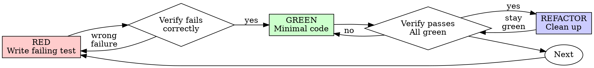

# Test-Driven Development (TDD)

## Overview

Write the test first. Watch it fail. Write minimal code to pass.

**Core principle:** If you didn't watch the test fail, you don't know if it tests the right thing.

**Test through public interfaces, not implementation details.** Tests describe *what* the system does, not *how*. If you rename an internal function and tests fail without behavior changing, those tests were testing implementation — they're brittle and they're lying.

**Violating the letter of the rules is violating the spirit of the rules.**

## Running Tests in This Project

The examples below are in TypeScript — they teach the *principle*, not the syntax. In this repo the two stacks are:

```bash
docker compose exec backend pytest path/to/test_file.py   # backend (FastAPI) — pytest
docker compose exec frontend npm run test src/Thing.test.jsx  # frontend (React) — Vitest + Testing Library
```

Always run through the container (the real environment is the container's, not the host's). The RED/GREEN cycle is identical regardless of stack: write one test, run it, watch it fail for the right reason, write minimal code, watch it pass.

## When to Use

**Always:**
- New features
- Bug fixes
- Refactoring
- Behavior changes

**Exceptions (ask your human partner):**
- Throwaway prototypes
- Generated code
- Configuration files

Thinking "skip TDD just this once"? Stop. That's rationalization.

## The Iron Law

```
NO PRODUCTION CODE WITHOUT A FAILING TEST FIRST
```

Write code before the test? Delete it. Start over.

**No exceptions:**
- Don't keep it as "reference"
- Don't "adapt" it while writing tests
- Don't look at it
- Delete means delete

Implement fresh from tests. Period.

## Horizontal Slicing — The Other Way to Fake TDD

**DO NOT write all tests first, then all implementation.** That's not TDD — it's tests-first theater.

```
WRONG (horizontal):
  RED:   test1, test2, test3, test4, test5
  GREEN: impl1, impl2, impl3, impl4, impl5

RIGHT (vertical, tracer bullets):
  RED→GREEN: test1→impl1
  RED→GREEN: test2→impl2
  ...
```

Tests written in bulk test *imagined* behavior, not *actual* behavior. They lock you into shapes (data structures, signatures) before you understand the implementation. They pass when behavior breaks and fail when behavior is fine.

**One test → one implementation → repeat.** Each test responds to what you learned from the previous cycle.

## Red-Green-Refactor



### RED - Write Failing Test

Write one minimal test showing what should happen.

<Good>
```typescript
test('retries failed operations 3 times', async () => {
  let attempts = 0;
  const operation = () => {
    attempts++;
    if (attempts < 3) throw new Error('fail');
    return 'success';
  };

  const result = await retryOperation(operation);

  expect(result).toBe('success');
  expect(attempts).toBe(3);
});
```
Clear name, tests real behavior, one thing
</Good>

<Bad>
```typescript
test('retry works', async () => {
  const mock = jest.fn()
    .mockRejectedValueOnce(new Error())
    .mockRejectedValueOnce(new Error())
    .mockResolvedValueOnce('success');
  await retryOperation(mock);
  expect(mock).toHaveBeenCalledTimes(3);
});
```
Vague name, tests mock not code
</Bad>

**Requirements:**
- One behavior
- Clear name
- Real code (no mocks unless unavoidable)

### Verify RED - Watch It Fail

**MANDATORY. Never skip.**

```bash
docker compose exec backend pytest path/to/test_file.py
```

Confirm:
- Test fails (not errors)
- Failure message is expected
- Fails because feature missing (not typos)

**Test passes?** You're testing existing behavior. Fix test.

**Test errors?** Fix error, re-run until it fails correctly.

### GREEN - Minimal Code

Write simplest code to pass the test.

<Good>
```typescript
async function retryOperation<T>(fn: () => Promise<T>): Promise<T> {
  for (let i = 0; i < 3; i++) {
    try {
      return await fn();
    } catch (e) {
      if (i === 2) throw e;
    }
  }
  throw new Error('unreachable');
}
```
Just enough to pass
</Good>

<Bad>
```typescript
async function retryOperation<T>(
  fn: () => Promise<T>,
  options?: {
    maxRetries?: number;
    backoff?: 'linear' | 'exponential';
    onRetry?: (attempt: number) => void;
  }
): Promise<T> {
  // YAGNI
}
```
Over-engineered
</Bad>

Don't add features, refactor other code, or "improve" beyond the test.

### Verify GREEN - Watch It Pass

**MANDATORY.**

```bash
docker compose exec backend pytest path/to/test_file.py
```

Confirm:
- Test passes
- Other tests still pass
- Output pristine (no errors, warnings)

**Test fails?** Fix code, not test.

**Other tests fail?** Fix now.

### REFACTOR - Clean Up

After green only. Keep tests green throughout. Don't add behavior.

Look for:
- **Duplication** → extract function/class
- **Long methods** → break into private helpers (keep tests on the public interface)
- **Shallow modules** (large interface, thin implementation) → combine or deepen — small interface + complex implementation hidden behind it
- **Feature envy** (method uses another object's data more than its own) → move logic to where the data lives
- **Primitive obsession** (passing strings/ints when a value object would carry intent) → introduce value objects
- **What the new code revealed about old code** → opportunistic cleanup, scoped to what you touched

### Repeat

Next failing test for next feature.

## Good Tests

| Quality | Good | Bad |
|---------|------|-----|
| **Minimal** | One thing. "and" in name? Split it. | `test('validates email and domain and whitespace')` |
| **Clear** | Name describes behavior | `test('test1')` |
| **Shows intent** | Demonstrates desired API | Obscures what code should do |

## Mocking — Boundaries Only

Mock at **system boundaries**. Not your own code.

**OK to mock:**
- External APIs (payment, email, third-party services)
- Time, randomness, UUIDs
- File system (sometimes — prefer tmp dirs)
- Slow / non-deterministic infrastructure

**Don't mock:**
- Your own classes, modules, services
- Internal collaborators
- Anything you control

If a test needs heavy internal mocking, the design is too coupled — fix the design, not the test. See `testing-anti-patterns.md` for the deeper traps (testing mock behavior, incomplete mocks, side-effect loss).

**Note for this project's backend:** the MySQL access is raw SQL. Prefer testing against a real test database (a throwaway schema or a transaction rolled back per test) over mocking the cursor — mocking `cursor.execute` tests the mock, not your SQL. The DB is the boundary, but a *real test DB* gives you honest coverage of the actual queries. Mock only truly external things (third-party HTTP, time).

**Designing for mockability at boundaries:**
- **Inject dependencies** instead of constructing them inside (`processOrder(order, paymentClient)`, not `processOrder(order)` that news up Stripe internally).
- **Return values** instead of mutating arguments — easier to assert.
- **SDK-style boundary clients** (one function per external operation) beat one generic `fetch(endpoint, options)` that needs conditional mocks.

## Why Order Matters

**"I'll write tests after to verify it works"**

Tests written after code pass immediately. Passing immediately proves nothing:
- Might test wrong thing
- Might test implementation, not behavior
- Might miss edge cases you forgot
- You never saw it catch the bug

Test-first forces you to see the test fail, proving it actually tests something.

**"I already manually tested all the edge cases"**

Manual testing is ad-hoc. You think you tested everything but:
- No record of what you tested
- Can't re-run when code changes
- Easy to forget cases under pressure
- "It worked when I tried it" ≠ comprehensive

Automated tests are systematic. They run the same way every time.

**"Deleting X hours of work is wasteful"**

Sunk cost fallacy. The time is already gone. Your choice now:
- Delete and rewrite with TDD (X more hours, high confidence)
- Keep it and add tests after (30 min, low confidence, likely bugs)

The "waste" is keeping code you can't trust. Working code without real tests is technical debt.

**"TDD is dogmatic, being pragmatic means adapting"**

TDD IS pragmatic:
- Finds bugs before commit (faster than debugging after)
- Prevents regressions (tests catch breaks immediately)
- Documents behavior (tests show how to use code)
- Enables refactoring (change freely, tests catch breaks)

"Pragmatic" shortcuts = debugging in production = slower.

**"Tests after achieve the same goals - it's spirit not ritual"**

No. Tests-after answer "What does this do?" Tests-first answer "What should this do?"

Tests-after are biased by your implementation. You test what you built, not what's required. You verify remembered edge cases, not discovered ones.

Tests-first force edge case discovery before implementing. Tests-after verify you remembered everything (you didn't).

30 minutes of tests after ≠ TDD. You get coverage, lose proof tests work.

## Common Rationalizations

| Excuse | Reality |
|--------|---------|
| "Too simple to test" | Simple code breaks. Test takes 30 seconds. |
| "I'll test after" | Tests passing immediately prove nothing. |
| "Tests after achieve same goals" | Tests-after = "what does this do?" Tests-first = "what should this do?" |
| "Already manually tested" | Ad-hoc ≠ systematic. No record, can't re-run. |
| "Deleting X hours is wasteful" | Sunk cost fallacy. Keeping unverified code is technical debt. |
| "Keep as reference, write tests first" | You'll adapt it. That's testing after. Delete means delete. |
| "Need to explore first" | Fine. Throw away exploration, start with TDD. |
| "Test hard = design unclear" | Listen to test. Hard to test = hard to use. |
| "TDD will slow me down" | TDD faster than debugging. Pragmatic = test-first. |
| "Manual test faster" | Manual doesn't prove edge cases. You'll re-test every change. |
| "Existing code has no tests" | You're improving it. Add tests for existing code. |

## Red Flags - STOP and Start Over

- **Wrote multiple tests before any implementation** (horizontal slicing — tests-first theater, not TDD)
- Code before test
- Test after implementation
- Test passes immediately
- Can't explain why test failed
- Tests added "later"
- Rationalizing "just this once"
- "I already manually tested it"
- "Tests after achieve the same purpose"
- "It's about spirit not ritual"
- "Keep as reference" or "adapt existing code"
- "Already spent X hours, deleting is wasteful"
- "TDD is dogmatic, I'm being pragmatic"
- "This is different because..."

**All of these mean: Delete code. Start over with TDD.**

## Example: Bug Fix

**Bug:** Empty email accepted

**RED**
```typescript
test('rejects empty email', async () => {
  const result = await submitForm({ email: '' });
  expect(result.error).toBe('Email required');
});
```

**Verify RED**
```bash
$ pytest  # or npm run test
FAIL: expected 'Email required', got undefined
```

**GREEN**
```typescript
function submitForm(data: FormData) {
  if (!data.email?.trim()) {
    return { error: 'Email required' };
  }
  // ...
}
```

**Verify GREEN**
```bash
$ pytest
PASS
```

**REFACTOR**
Extract validation for multiple fields if needed.

## Verification Checklist

Before marking work complete:

- [ ] Every new function/method has a test
- [ ] Watched each test fail before implementing
- [ ] Each test failed for expected reason (feature missing, not typo)
- [ ] Wrote minimal code to pass each test
- [ ] All tests pass
- [ ] Output pristine (no errors, warnings)
- [ ] Tests use real code (mocks only if unavoidable)
- [ ] Edge cases and errors covered

Can't check all boxes? You skipped TDD. Start over.

## When Stuck

| Problem | Solution |
|---------|----------|
| Don't know how to test | Write wished-for API. Write assertion first. Ask your human partner. |
| Test too complicated | Design too complicated. Simplify interface. |
| Must mock everything | Code too coupled. Use dependency injection. |
| Test setup huge | Extract helpers. Still complex? Simplify design. |

## Debugging Integration

Bug found? Write failing test reproducing it. Follow TDD cycle. Test proves fix and prevents regression.

Never fix bugs without a test.

### Regression test: red → green → revert → red → restore → green

A regression test that "passes" once is only proof that the test runs — not that it would actually catch the bug coming back. Verify it for real:

1. **Write** the test that reproduces the bug.
2. **Run** → must FAIL (the bug is live, the test is honest).
3. **Apply** the fix → run → must PASS (the fix works).
4. **Temporarily revert** the fix (`git stash` the fix hunk only, or comment it out) → run → must FAIL AGAIN. This proves the test actually exercises the regression path. If it still passes, the test is testing the wrong thing — rewrite it.
5. **Restore** the fix → run → must PASS.
6. Commit. Now you have evidence both directions: the bug *was* present, the fix *removes* it, and the test *would catch* it returning.

Skipping step 4 is the most common regression-test mistake. A test that always passes — with or without the fix — is decoration, not protection.

## Testing Anti-Patterns

When adding mocks or test utilities, read @testing-anti-patterns.md to avoid common pitfalls:
- Testing mock behavior instead of real behavior
- Adding test-only methods to production classes
- Mocking without understanding dependencies

## Final Rule

```
Production code → test exists and failed first
Otherwise → not TDD
```

No exceptions without your human partner's permission.
