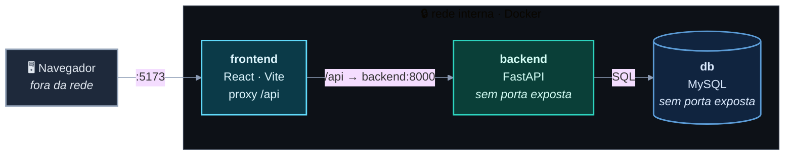

<p align="center">
  <picture>
    <source media="(prefers-color-scheme: dark)" srcset="assets/logo-dark.svg">
    <source media="(prefers-color-scheme: light)" srcset="assets/logo-light.svg">
    
  </picture>
</p>

<p align="center">
  <strong>Gestão e informação da ferrovia Santa Cruz — num só lugar.</strong>
</p>

<p align="center">
  
  
  
  
</p>

---

Aplicação web para **gerenciar** (lado admin) e **informar** (lado cliente e admin) a ferrovia Santa Cruz — horários, trens, estações e um dashboard completo, funcionando igual de bem no desktop e no celular. Desenvolvida como **SA (Situação de Aprendizagem)** de curso técnico, ao longo do ano letivo.

## O que tem aqui

| Camada | Stack | O que faz |
|--------|-------|-----------|
| **Frontend** | React · Vite · Vitest | UI responsiva (mobile-first) — dashboard admin e telas de informação do cliente |
| **Backend** | FastAPI · Python | API REST sob `/api/...`, acesso ao banco em SQL puro |
| **Banco** | MySQL 8 | Persistência — schema e seed em `db/` |

Os três rodam em **Docker Compose**, ligados por uma **rede interna**. Só o `frontend` é exposto pra fora; ele chama o `backend` por proxy, e o `backend` fala com o `db` — nenhum dos dois publica porta.



Detalhe completo (proxy, `depends_on`, healthchecks) em [`docs/arquitetura/containers-e-rede.md`](docs/arquitetura/containers-e-rede.md).

## Como começar

### Pré-requisitos

- [Docker](https://docs.docker.com/get-docker/) com o plugin Compose
- Porta `5173` livre

### Subir o projeto

```bash
git clone https://github.com/rafawzc/ferrovia_santa_cruz.git && cd ferrovia_santa_cruz
docker compose up --build
```

O Compose sobe os serviços na ordem certa (`db → backend → frontend`) e espera o banco aceitar conexão antes do backend ligar. Quando terminar, abra **http://localhost:5173**.

As chamadas de API (`/api/...`) são repassadas internamente ao backend — não há porta de backend nem de banco exposta na sua máquina.

### Uso no dia a dia

```bash
docker compose up -d        # sobe em background
docker compose logs -f      # acompanha os logs
docker compose down         # derruba tudo
```

### Testes

```bash
docker compose exec backend pytest          # backend (pytest)
docker compose exec frontend npm run test   # frontend (Vitest)
```

## Estrutura do projeto

```
ferrovia_santa_cruz/
├── frontend/           # React + Vite — UI responsiva (admin + cliente)
├── backend/            # FastAPI — API REST, SQL puro pro MySQL
├── db/                 # init/seed SQL do MySQL
├── docs/               # documentação do projeto (ver docs/CLAUDE.md)
├── assets/             # mídia do README (logo)
├── docker-compose.yml  # 3 serviços: frontend, backend, db
└── .claude/            # configuração e instruções do agente de IA
```

## Documentação

A pasta [`docs/`](docs/CLAUDE.md) concentra toda a documentação — arquitetura, acesso a dados, responsividade e o registro de decisões. Comece pelo índice em [`docs/CLAUDE.md`](docs/CLAUDE.md); as decisões técnicas e seus porquês ficam em [`docs/decisoes/stack.md`](docs/decisoes/stack.md).
