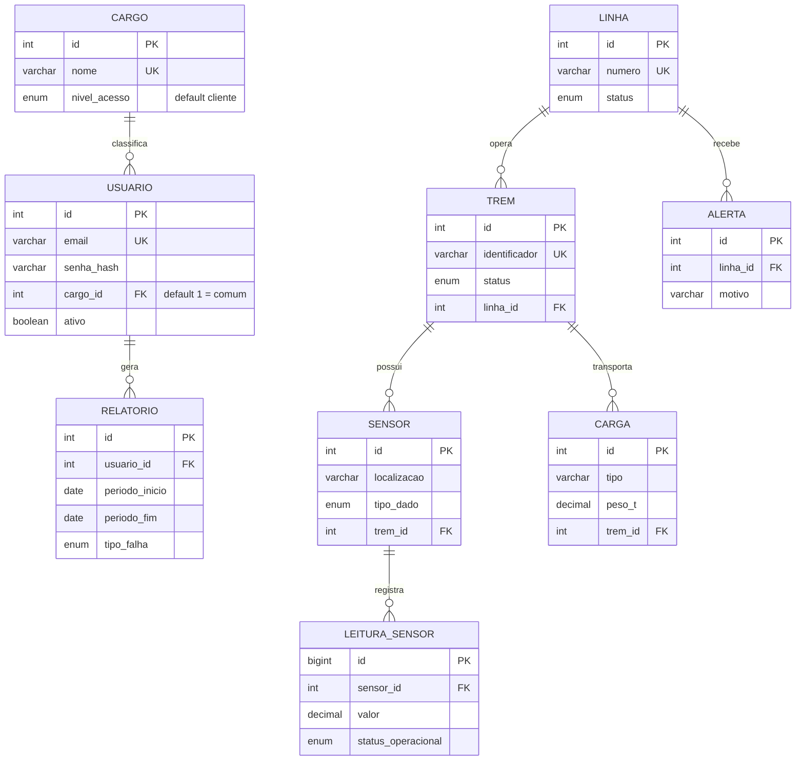
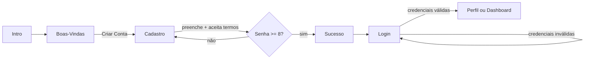
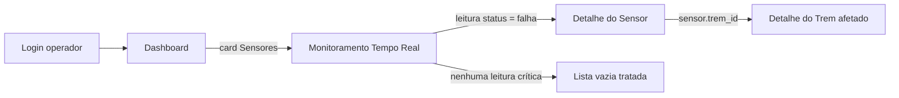
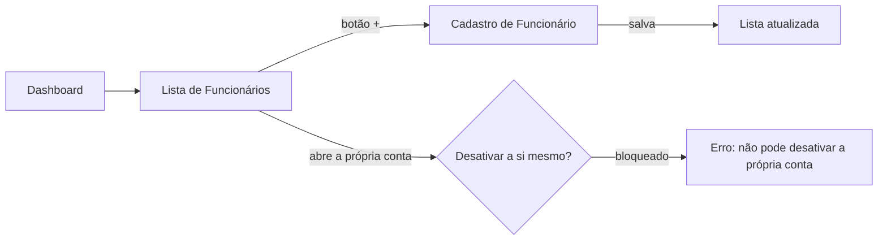
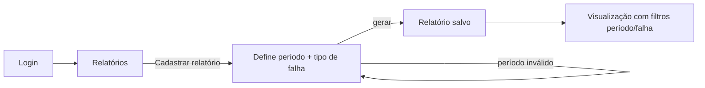
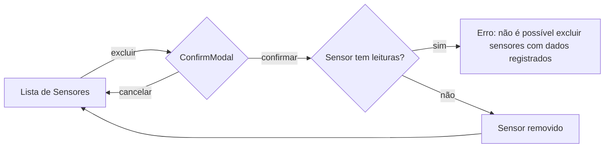
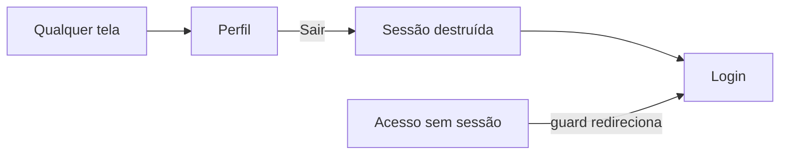

# Plano de Implementação — Ferrovia Santa Cruz

> **Entrega 2 — Planejamento de implementação (S.A. Ferrorama).** Documento que orienta o início da fase de codificação: stack, arquitetura de arquivos, componentes reutilizáveis, ordem de construção, fluxos de navegação e critérios de qualidade.
>
> Capacidades: **CT6** (padrão de projeto), **CT13** (especificações técnicas e paradigmas), **CS3** (organização).

---

## 1. Identificação e visão geral

- **Integrantes:** Guilherme Wohl · Helena Kemczinski · Rafael Fodi · Yasmin Cota
- **Mockup (Canva):** <https://canva.link/95klb9rd2hzqxc1>
- **Repositório:** este (a entrega vive em `docs/PLANO_IMPLEMENTACAO.md`)

### Resumo do sistema

A **Ferrovia Santa Cruz** é um sistema web de **gestão e informação** de uma ferrovia. Do lado **admin** (gestor/operador), centraliza o monitoramento de linhas, carga e passageiros, funcionários, manutenções e o envio de alertas. Do lado **cliente**, entrega informação e o gerenciamento do próprio perfil. O diferencial é ser um **dashboard único, responsivo de verdade** (mobile-first 390px → desktop 1440px), com os dois lados convivendo no mesmo app por rotas e papéis distintos.

### Decisão de stack

A SA já tem a stack decidida e registrada em [`docs/decisoes/stack.md`](decisoes/stack.md). Resumo com a justificativa de cada escolha:

| Camada | Escolha | Por quê (e não a alternativa) |
|--------|---------|-------------------------------|
| **Frontend** | **React + Vite** | Componentização real (a Seção 3 mostra quanto se repete entre telas) e reuso de UI sem copiar-colar HTML. Vite dá dev-server rápido com HMR e o `proxy` que liga o front ao backend internamente. Preferido a **HTML/CSS/JS puro** porque o sistema tem estado, rotas e dezenas de componentes repetidos — vanilla viraria duplicação e manipulação manual de DOM. |
| **Estilo** | **CSS por componente (CSS Modules) + tokens globais** | Cada componente carrega seu CSS com escopo isolado (sem vazamento de classe), e cores/tipografia ficam num único arquivo de tokens. Preferido a **Bootstrap** porque o mockup tem identidade visual própria (paleta marrom/bege, Poppins) — Bootstrap traria um tema que brigaria com o design e peso que não usaríamos. CSS puro com tokens dá controle total sobre a fidelidade ao mockup. |
| **Backend** | **FastAPI (API REST)** | API REST em Python servindo JSON pro front, com validação e docs automáticas (Pydantic/OpenAPI). |
| **Banco** | **MySQL 8 + SQL puro** (`mysql-connector-python`, sem ORM) | Decisão de projeto (ver `stack.md`). Exige toda query **parametrizada** contra SQL-injection. |
| **Infra** | **Docker Compose** — 3 containers (frontend/backend/db), rede interna, só o front exposto | Isolamento: backend e banco nunca acessíveis de fora. Detalhe em [`docs/arquitetura/containers-e-rede.md`](arquitetura/containers-e-rede.md). |

> **Nota sobre o paradigma:** o enunciado dá exemplos em HTML/CSS/JS vanilla, mas a stack do grupo é baseada em componentes (React). Os critérios de "pronto" (Seção 6) foram **adaptados ao paradigma de componentes** sem perder a intenção: "HTML semântico" continua valendo (JSX gera HTML — usamos `header/main/section/nav/footer`), "CSS sem inline" vira "estilo em CSS Modules/tokens, sem `style={{}}` solto".

---

## 2. Arquitetura de arquivos e pastas

A estrutura segue a separação já estabelecida no repositório (frontend / backend / db / docs em containers). Abaixo, o detalhe de **onde cada tela e cada peça reutilizável vive**.

```
ferrovia_santa_cruz/
├── frontend/                      # React + Vite
│   ├── index.html
│   ├── vite.config.js             # proxy /api → backend:8000
│   ├── package.json
│   └── src/
│       ├── main.jsx               # bootstrap React
│       ├── App.jsx                # providers + router raiz
│       ├── styles/
│       │   ├── tokens.css         # paleta (hex do guia), tipografia Poppins, espaçamentos
│       │   └── global.css         # reset + base
│       ├── components/            # PEÇAS REUTILIZÁVEIS (Seção 3) — uma pasta por componente
│       │   ├── Button/
│       │   │   ├── Button.jsx
│       │   │   └── Button.module.css
│       │   ├── FormField/         # input pill + label + senha c/ olho + helper/erro
│       │   ├── Toggle/            # switch (termos, localização)
│       │   ├── InfoCard/         # card de métrica com ícone (dashboard)
│       │   ├── UserCard/          # card de funcionário (foto/cargo/status)
│       │   ├── LineCard/          # card de linha com status colorido
│       │   ├── StatusBadge/       # pílula de status (manutenção/atraso/fechado/ativo…)
│       │   ├── ScreenHeader/      # título + botão voltar opcional
│       │   ├── BottomNav/         # tab bar (variante admin × cliente)
│       │   ├── Tabs/              # pills Carga/Cadastro/Relatório
│       │   ├── DataTable/         # tabela de listagem
│       │   └── Modal/             # card-modal com X (cadastro de manutenção)
│       ├── pages/                 # UMA PASTA POR TELA, agrupada por área
│       │   ├── auth/              # Intro, BoasVindas, Login, Cadastro, LoginGoogle
│       │   ├── admin/             # Dashboard, Linhas, Carga, CargaCadastro, Relatorio,
│       │   │                      #   Funcionarios, FuncionarioForm, Alertas, Trens, Sensores
│       │   └── cliente/           # Perfil, PerfilEdicao
│       ├── routes/                # definição de rotas + guards (admin × cliente)
│       ├── context/               # AuthContext (usuário logado + papel)
│       ├── services/              # CAMADA DE API — um arquivo por recurso
│       │   ├── http.js            # wrapper fetch base, sempre /api relativo
│       │   ├── auth.js            # login, cadastro, logout, token
│       │   ├── usuarios.js
│       │   ├── carga.js
│       │   ├── linhas.js
│       │   └── alertas.js
│       ├── hooks/                 # hooks compartilhados (ex: useAuth)
│       └── assets/                # imagens/ícones locais
├── backend/                       # FastAPI — espelha os recursos do front
│   └── app/
│       ├── main.py                # cria app, registra routers
│       ├── db.py                  # conexão/pool centralizado (único ponto)
│       ├── core/                  # config (env), security (hash/token)
│       ├── routers/               # auth.py, usuarios.py, carga.py, linhas.py, alertas.py …
│       └── models/                # Pydantic request/response por recurso
├── db/                            # schema.sql + seed.sql
├── docs/                          # documentação (este arquivo + índice)
└── docker-compose.yml
```

### Justificativa da estrutura

- **`components/` separado de `pages/`** — a regra que guia tudo: o que se repete em mais de uma tela vira componente; o que é uma tela específica vira página. Isso é o que impede copiar-colar HTML entre telas (a dor que a Seção 3 mapeia).
- **CSS por componente (CSS Modules), não um CSS por tela** — escolhemos colocar o estilo **junto do componente** (`Button.module.css` ao lado de `Button.jsx`), com escopo isolado, em vez de um arquivo de estilo por tela. Motivo: um botão aparece em 6 telas — se o estilo morasse "por tela", o mesmo botão teria 6 cópias de CSS e divergiria. Com CSS por componente, o estilo existe **uma vez** e toda tela que usa o `Button` herda. As variáveis globais (cores do guia, Poppins) ficam em `styles/tokens.css` — fonte única da verdade, consumida por todos os módulos.
- **`services/` com um arquivo por recurso (`auth.js` separado de `usuarios.js`, `carga.js`…)** — equivale ao "`auth.js` separado de `dados.js`" do enunciado. Separamos porque as responsabilidades são distintas: `auth.js` lida com login/token/sessão (lógica sensível, muda raramente); `usuarios.js`/`carga.js` são CRUD de dados (mudam junto com cada tela). Misturar acoplaria a sessão a cada recurso e tornaria difícil testar/trocar um sem mexer no outro. Cada tela importa só o serviço que precisa.
- **Backend espelha o frontend** (um router por recurso = um service por recurso). Quem mexe na tela de Carga sabe exatamente onde está a API de Carga.
- **Conexão ao banco num único `db.py`** — nunca abrir conexão crua espalhada; garante pool e fechamento de cursor centralizados (e o ponto único onde a parametrização anti-injection é garantida).

### Modelo de dados

O banco (MySQL 8, SQL puro) une **o que o mockup exige** (usuários, linhas, carga, alertas) com **os dados de monitoramento IoT** (trens, sensores, leituras em tempo real, relatórios). Cada `router` do backend opera uma dessas entidades. Detalhe completo (tipos, chaves, integridade referencial) em [`docs/banco/modelo-de-dados.md`](banco/modelo-de-dados.md).



Duas decisões de modelagem que valem destacar:

- **Cargo é uma tabela** (`usuario.cargo_id` FK → `cargo`), normalizada do antigo ENUM. Todo registro novo nasce **`comum`** (`DEFAULT 1`) — só um admin promove. `cargo.nivel_acesso` (`cliente`/`operacional`/`gestao`) encoda a matriz de acesso (Seção 5) no banco. Ver decisão superada em [`banco/modelo-de-dados.md`](banco/modelo-de-dados.md).
- **Sensor não pode ser excluído se tiver leituras** — o FK `leitura_sensor.sensor_id` usa `ON DELETE RESTRICT`. A regra mora no schema; a API só traduz o erro do banco para a mensagem ao usuário.

---

## 3. Componentes reutilizáveis identificados

Levantados varrendo as telas do mockup ([`docs/design/`](design/)). Cada um aparece em mais de uma tela — construir uma vez, reutilizar.

| Componente | Telas em que aparece | Variações observadas |
|------------|----------------------|----------------------|
| **Botão primário** (`Button`) | BoasVindas, Login, Cadastro, Cadastro de carga, Cadastro de funcionário, Alertas (Enviar), Dashboard (Adicionar/Cadastrar) | Normal · **hover** · **desabilitado** · com ícone (digital/+) · sem ícone · variante clara (botão Google) |
| **Campo de formulário** (`FormField`) | Login, Cadastro, Cadastro de funcionário, Cadastro de carga, Alertas, Perfil | Texto · **senha (com toggle de olho)** · preenchido · vazio · com helper ("mín. 8 caracteres") · **estado de erro** · **read-only** (perfil em leitura) |
| **Toggle/Switch** (`Toggle`) | Login, Cadastro | Ligado (verde) · desligado — usados em "aceito os termos" e "permitir localização" |
| **Card de métrica** (`InfoCard`) | Dashboard (Linhas ativas, Manutenção, Sensores) | Com ícone + número · (previsto: com badge de alerta quando valor crítico) |
| **Card de funcionário** (`UserCard`) | Lista de funcionários | Status **Ativo** · status **Inativo** (hoje só texto — ver divergência abaixo) |
| **Card de linha** (`LineCard`) | Gestão de Rotas (Linhas) | Status colorido: **Manutenção** (amarelo) · **Atraso** (laranja) · **Fechado** (vermelho) · **Na estação** / **Já partiu** (verde) · eixo Ativo/Inativo |
| **Status badge** (`StatusBadge`) | Linhas, Alertas, Funcionários | Por cor/label de status — núcleo reutilizado pelos cards acima |
| **Header de tela** (`ScreenHeader`) | Quase todas as telas internas | Com botão voltar (←) · sem voltar (telas raiz) · com título |
| **Tab bar inferior** (`BottomNav`) | Todas as telas internas | **Admin** (5 itens, item "Funcionários") × **Cliente** (item "Perfil") · item ativo expandido com label |
| **Tabs/pills** (`Tabs`) | Monitoramento de Carga | Carga · Cadastro · Relatório — item selecionado destacado |
| **Tabela de listagem** (`DataTable`) | Carga (variante tabela), base para Relatórios | Colunas tipo/peso/destino · (previsto: ordenável/filtrável) |
| **Modal de cadastro** (`Modal`) | Dashboard (Insira o Problema / Insira o Horário) | Com X de fechar · com stepper de horário |
| **Logo / wordmark** | Intro, BoasVindas, Login, Cadastro | Versão grande (intro) · compacta (canto das telas wide) |

> **Estados visuais a implementar em todo componente interativo (Avançado):** `Button` e `FormField` precisam de **hover**, **foco**, **desabilitado** e **erro** mesmo onde o mockup só mostra o estado normal — são exigência dos critérios de "pronto" (Seção 6).
>
> **Divergência de design a resolver:** o guia de cores ([`design/guia-de-estilo/paleta-de-cores.png`](design/guia-de-estilo/paleta-de-cores.png)) é monocromático (marrom/bege) e **não define cores de status**, mas a tela de Linhas usa amarelo/laranja/vermelho/verde. O grupo precisa **adicionar cores de status aos tokens** (em `styles/tokens.css`) para o `StatusBadge` ser consistente. Decisão a registrar quando feita.

> **Componentes a inserir (exigidos pelo comportamento, ainda fora do mockup):** o design vai crescer — construímos o componente e o design entra quando a tela existir:
> - **`ConfirmModal`** (modal de confirmação) — **requisito firme**: excluir um sensor (e desativar funcionário) só acontece após confirmação. Toda ação destrutiva passa por ele.
> - **`Toast`/feedback de sucesso/erro** — vários fluxos terminam em "sistema mostra sucesso" (cadastro, salvar perfil) ou erro ("Não é possível excluir sensores com dados registrados"). O mockup não tem componente de feedback.

---

## 4. Ordem de implementação

Ordenado por **dependência técnica**: o que é base de outras coisas vem antes. Componente reutilizável existe antes da tela que o usa; lista existe antes de detalhe/cadastro.

| # | O que | Depende de | Justificativa (incl. dependências não óbvias) |
|---|-------|------------|-----------------------------------------------|
| 1 | **Tokens + estilos globais** (`tokens.css`, `global.css`) | — | Cor, Poppins e espaçamento são consumidos por **todo** componente. Sem isso, todo componente nasceria com valor chumbado e divergiria. |
| 2 | **Componentes-base** (`Button`, `FormField`, `Toggle`, `StatusBadge`, `Card`s, `ScreenHeader`, `BottomNav`, `Tabs`, `DataTable`, `Modal`) | 1 | Toda tela é montada com esses. Construí-los antes evita copiar-colar e garante consistência. `StatusBadge` antes de `LineCard` (o card usa o badge). |
| 3 | **Telas de autenticação** (Intro → BoasVindas → Login / Cadastro → LoginGoogle) | 2 | Não dependem de dado interno do sistema, e **todo o resto depende de estar logado**. São a porta de entrada. |
| 4 | **Shell de navegação: rotas + guards + `AuthContext`** | 3 | Depende do login funcionar (não óbvio): o guard que separa **admin × cliente** só existe depois que há um usuário com papel. É o que conecta as telas. |
| 5 | **Dashboard (admin)** | 2, 4 | Agrega métricas de vários módulos. Pode ser construído **com dados mock** e plugado aos dados reais depois — por isso entra cedo, em paralelo aos módulos, sem esperar todos prontos. |
| 6 | **Módulo Funcionários** (lista → cadastro/detalhe → editar) | 2, 4 | Lista antes de detalhe: a tela de detalhe/edição só faz sentido a partir de um item da lista. Lado admin. |
| 7 | **Módulo Carga** (lista → cadastro → **relatório**) | 2, 4, `DataTable` | Lista antes de cadastro/relatório. O Relatório reusa `DataTable` e os dados de carga — por isso vem **depois** da lista de carga existir. |
| 8 | **Módulo Linhas** (Gestão de Rotas) | 2, `LineCard`, `StatusBadge` | Depende dos cards de status e das cores de status (divergência da Seção 3 resolvida antes). |
| 9 | **Módulo Alertas** | 2, 8 | O alerta referencia uma **linha** (campo "Nome da linha") — depende do conceito de linha já modelado. |
| 10 | **Lado Cliente: Perfil (leitura → edição)** | 4, `FormField` | Reusa o `FormField` (com read-only) e o guard de papel cliente. |
| 11 | **Módulo Monitoramento IoT: Trens → Sensores → Leituras/Tempo real → Relatórios** | 2, modelo de dados, `DataTable`, `ConfirmModal` | Ordem por dependência de dados: **trem** existe antes do **sensor** (sensor pertence a um trem), que existe antes das **leituras**, que alimentam o **monitoramento** e os **relatórios**. As telas não estão no mockup — desenhar primeiro —, mas o **dado e os endpoints já estão modelados** (Seção 2). |
| — | **Backend (paralelo)**: `db.py` → `schema.sql`/`seed.sql` → routers por recurso, na ordem das dependências de dados (usuário → linha → trem → sensor → leitura → carga → alerta → relatório) | modelo de dados | Cada router espelha uma entidade. Inserir/criar os pais antes dos filhos (FK). Construído junto com a tela correspondente. |

### Cobertura: mockup + monitoramento IoT

O mockup atual ([`docs/design/mockup-entrega-1.md`](design/mockup-entrega-1.md)) cobre o lado de **gestão** (auth, dashboard, linhas, carga, funcionários, alertas), mas **não tem tela dedicada** de Trens, Sensores nem Relatórios — eles aparecem só como referência indireta (ícone de trem/gráfico na nav, "Sensores 10" no dashboard, pill "Relatório" instável em Carga).

Como a Avaliação Prática de Banco de Dados pede exatamente esse lado IoT (sensores vinculados a trens, leituras em tempo real, relatórios por período/falha), o grupo **modelou essas entidades no banco** (Seção 2) e as posicionou na ordem (passo 11). Ou seja: **o dado dos três já existe**; falta só desenhar e construir a tela. Isso fecha a lacuna da rubrica CT13 sem inventar — o que estava implícito no mockup vira tela com backing real.

---

## 5. Fluxos de navegação do usuário

Esta seção amarra **rota → tela → o que faz → quem acessa** e depois traça as jornadas completas.

> **Papéis (derivados do `cargo` do usuário, Seção 2):** **Comum** (cargo `comum`, default) — cliente, só o próprio perfil · **Operacional** (maquinista, agente, manutenção…) — monitora linhas, carga, trens, sensores e relatórios · **Admin** (`admin`/`administracao`/`rh`) — tudo, inclusive gerir usuários.

### Mapa de rotas e acesso

Caminho relativo no front (o React Router resolve; guards barram por papel). `(a desenhar)` = tela do lado IoT que ainda não tem mockup, mas já tem dado modelado.

| Rota | Tela | Acesso | O que faz |
|------|------|--------|-----------|
| `/` | Intro (splash) | público | Abertura de marca → encaminha para Boas-Vindas |
| `/boas-vindas` | Boas-Vindas | público | Escolha: criar conta / acessar / Google |
| `/login` | Login | público | Autentica e-mail+senha contra `usuario`; cria sessão; encaminha por papel |
| `/cadastro` | Cadastro | público | Cria `usuario` com `cargo = comum` (default) |
| `/perfil` | Perfil (leitura) | comum | Mostra os próprios dados |
| `/perfil/editar` | Perfil (edição) | comum | Atualiza os próprios dados |
| `/admin` | Dashboard | operacional · admin | Métricas agregadas (linhas ativas, manutenção, sensores, frota) |
| `/admin/linhas` | Gestão de Rotas | operacional · admin | Lista `linha` com status colorido |
| `/admin/carga` | Monitoramento de Carga | operacional · admin | Ocupação de vagões/poltronas + listagem |
| `/admin/carga/cadastro` | Cadastro de Carga | operacional · admin | Cria `carga` |
| `/admin/alertas` | Alertas | operacional · admin | Cria `alerta` vinculado a uma `linha` |
| `/admin/funcionarios` | Lista de Funcionários | **admin** | Lista `usuario` (equipe) |
| `/admin/funcionarios/cadastro` | Cadastro de Funcionário | **admin** | Cria `usuario` com cargo de equipe |
| `/admin/funcionarios/:id` | Detalhe / Editar | **admin** | Edita ou **desativa** um `usuario` |
| `/admin/trens` | Trens *(a desenhar)* | operacional · admin | Lista `trem` + status |
| `/admin/sensores` | Sensores *(a desenhar)* | operacional · admin | Lista `sensor`, detalhe e **excluir** |
| `/admin/sensores/cadastro` | Cadastro de Sensor *(a desenhar)* | operacional · admin | Cria `sensor` vinculado a um `trem` |
| `/admin/monitoramento` | Tempo Real *(a desenhar)* | operacional · admin | Velocidade/localização/status das `leitura_sensor` |
| `/admin/relatorios` | Relatórios *(a desenhar)* | operacional · admin | Gera e lista `relatorio` (filtro período/tipo de falha) |

### Fluxos

Cada fluxo: objetivo, perfil e a jornada (incluindo caminhos fora do "caminho feliz").

**Fluxo 1 — Cadastrar-se e acessar pela primeira vez** · *Perfil: novo usuário (comum)*



**Fluxo 2 — Operador identifica leitura de sensor crítica e vê o trem afetado** · *Perfil: operacional*



**Fluxo 3 — Admin cadastra um funcionário** · *Perfil: admin*



**Fluxo 4 — Gerar e visualizar relatório por período/tipo de falha** · *Perfil: operacional · admin*



**Fluxo 5 — Excluir um sensor (com confirmação e regra de integridade)** · *Perfil: operacional · admin*



**Fluxo 6 — Logout** · *Perfil: qualquer*



---

## 6. Critérios de "pronto"

Checklist aplicado a **toda tela** antes de fechá-la. Adaptado ao paradigma de componentes (React), mantendo a intenção do enunciado.

- [ ] **JSX semântico** — usa `header`, `main`, `section`, `nav`, `footer` corretamente; nada de "div-soup".
- [ ] **Sem estilo inline** — estilos em CSS Modules; cores/tipografia vêm dos **tokens** (`tokens.css`), nunca hex chumbado no componente.
- [ ] **Mobile 390px** — funciona sem elementos cortados nem overflow horizontal.
- [ ] **Desktop 1440px** — layout adapta (a tela tem a versão wide do mockup quando existe).
- [ ] **Console limpo** — sem erros nem warnings do React (inclui `key` em listas).
- [ ] **Navegação correta** — todo link/botão leva à tela certa (mesmo que a função ainda não esteja ligada ao backend).
- [ ] **Fiel ao mockup** — cores, tipografia (Poppins) e espaçamento batem com o design; reusa os **componentes** da Seção 3 em vez de recriar.
- [ ] **API por caminho relativo** — quando integrar, chama `/api/...` (nunca URL absoluta do backend), via a camada `services/`.
- [ ] **Estados tratados** — loading, erro e vazio têm tratamento visível (nada de tela branca ou quebra).
- [ ] **Estados interativos** — botões e inputs têm hover, foco e desabilitado/erro implementados.
- [ ] **Acessibilidade básica** — `alt` em imagens, `label` associado a cada input, foco de teclado visível.
- [ ] **Tem teste** — ao menos um teste de render/interação no Vitest (alinhado ao TDD do projeto).
- [ ] **Backend (se a tela acessa dados):** toda query **parametrizada** (`%s`, nunca string montada) e input validado com Pydantic (erro → 4xx claro, não 500).
- [ ] **Revisão + commit** — código revisado por ≥1 integrante e commit com mensagem descritiva (conventional commits).

---

## Divisão entre integrantes

Cada integrante é **dono de um módulo** (1–2 telas principais + as variações). Os **componentes-base (passo 2)** são construídos **em conjunto no começo**, antes de cada um seguir para seu módulo — são a fundação compartilhada.

| Integrante | Módulo / telas | Backend correspondente |
|------------|----------------|------------------------|
| **Guilherme Wohl** | **Autenticação** (Intro, Boas-Vindas, Login, Cadastro, Login Google) + tokens/design system + **modelo de dados** | `routers/auth.py`, `db.py` + `schema.sql` |
| **Helena Kemczinski** | **Dashboard** + **Linhas** (Gestão de Rotas) + **Alertas** | `routers/linhas.py`, `routers/alertas.py` |
| **Rafael Fodi** | **Funcionários** (lista, cadastro, editar) + **Perfil** (lado cliente) | `routers/usuarios.py` |
| **Yasmin Cota** | **Carga** (lista, cadastro) + **Monitoramento IoT** (Trens, Sensores, Relatórios) | `routers/carga.py`, `routers/sensores.py`, `routers/relatorios.py` |

> Os **componentes-base** (passo 2) são construídos em conjunto no começo — fundação compartilhada. Rebalancear se necessário; a regra é ninguém com zero, ninguém com a tela do outro.
>
> **Evidência colaborativa (CS3):** cada integrante commita seu próprio módulo, com mensagens descritivas (conventional commits) e ao longo da atividade — não um commit único no fim. O histórico do repositório deve mostrar contribuição dos quatro.

---

## Pendências registradas

> O mockup é a base, mas **o design vai mudar/crescer ao longo do projeto** — estas são lacunas que já identificamos e vamos resolver desenhando a tela/componente na hora certa, não bloqueiam o início.

1. **Telas IoT a desenhar** — Trens, Sensores, Monitoramento e Relatórios (Seção 4, passo 11). **Dado já modelado** (Seção 2); falta só o desenho/UI.
2. **Cores de status nos tokens** — o guia de cores é monocromático; Linhas/`StatusBadge` precisam (Seção 3).
3. **Tela de recuperação de senha** — o link "Esqueceu sua senha?" existe no Login, mas **não há tela**. Falta desenhar.
4. **Indicadores de frota no Dashboard** — ampliar os `InfoCard`s para contagem de **trens ativos/manutenção/parados** (já temos `trem.status`) e velocidade média (de `leitura_sensor`).
5. **Componente `Toast`/feedback** — sucesso/erro ainda ausente do mockup (`ConfirmModal` já virou requisito firme, Seção 3).
6. **Telas de detalhe** — Carga e Trem têm lista/cadastro, mas não tela de **detalhe** de um item. Provável quando os fluxos amadurecerem.
7. **`db/schema.sql` + `db/seed.sql`** — escrever o script de criação + população (≥3 registros/tabela) a partir do modelo (Seção 2). Entrega da Avaliação Prática de Banco.
8. **Typos do mockup a corrigir** — "Matutenção"→Manutenção, "local de patida"→partida, "Entrar com com conta Google", botão de cadastro "Entrar"/"Criar" inconsistente, 3ª aba de Carga oscilando entre "Relatório"/"Destino".
