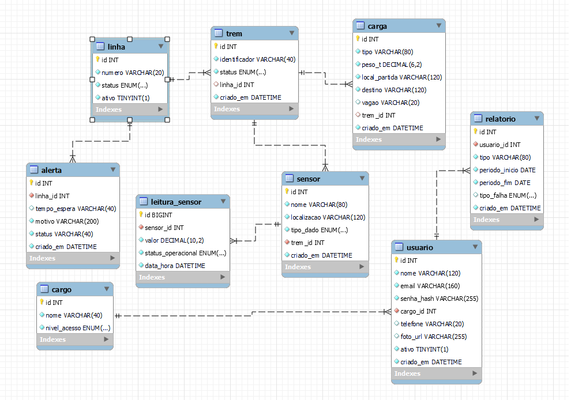
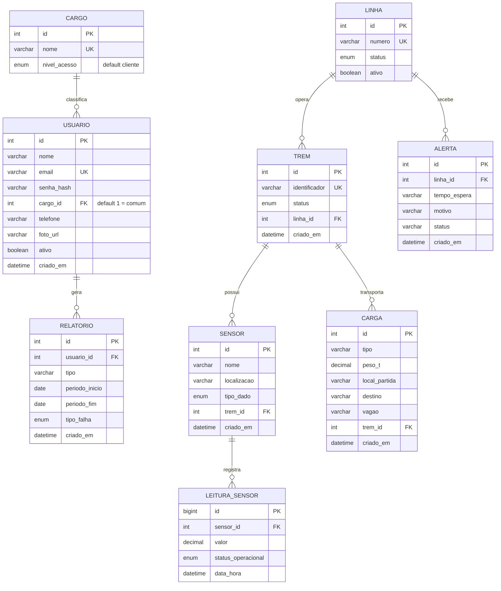

# Modelo de dados — Ferrovia Santa Cruz

> Modelo relacional do banco (MySQL 8, SQL puro). Reúne **o que o mockup da SA exige** (usuários, linhas, carga, alertas) com **o que a Avaliação Prática de Banco de Dados pede** (trens, sensores IoT, leituras em tempo real, relatórios). Um schema só, sem duplicação.
>
> Referenciado pelo [`PLANO_IMPLEMENTACAO.md`](../PLANO_IMPLEMENTACAO.md) (Seção 2). Fonte da verdade para o `db/schema.sql` + `db/seed.sql` quando forem escritos.

## Diagrama Entidade-Relacionamento

DER exportado do MySQL Workbench (reverse engineering do `db/schema.sql`) — é o artefato que a SA pede como entrega:

O mesmo modelo em Mermaid (versionável, edita-no-texto):

## Entidades e relacionamentos

| Entidade | O que é | Relacionamentos | Vem de |
|----------|---------|-----------------|--------|
| **cargo** | Função do usuário (comum, admin, maquinista…). `nivel_acesso` encoda a matriz de acesso. | classifica N `usuario` | Mockup (cargo do funcionário) + normalização do antigo ENUM |
| **usuario** | Quem acessa o sistema (login). Aponta pra um `cargo` (default `comum`). | gera N `relatorio`; tem 1 `cargo` | Mockup (login, funcionários, perfil) + atividade DB (login/admin) |
| **linha** | Rota da ferrovia, com status operacional. | opera N `trem`; recebe N `alerta` | Mockup (Gestão de Rotas) |
| **trem** | Locomotiva/composição. Roda numa linha. | tem N `sensor`; transporta N `carga` | Atividade DB (monitoramento) + mockup (campo "Trem") |
| **sensor** | Sensor IoT vinculado a um trem. Tipo de dado monitorado. | tem N `leitura_sensor` | Atividade DB (cadastro de sensores) |
| **leitura_sensor** | Cada medição enviada por um sensor (velocidade, temperatura, falha…) com status operacional. | pertence a 1 `sensor` | Atividade DB (monitoramento em tempo real) |
| **carga** | Carga/passageiros transportados, com peso, partida e destino. | vai em 1 `trem` (opcional) | Mockup (Monitoramento de Carga) |
| **alerta** | Notificação manual sobre uma linha (tempo de espera, motivo, status). | pertence a 1 `linha` | Mockup (Alertas) |
| **relatorio** | Relatório operacional gerado por um usuário, filtrável por período e tipo de falha. | pertence a 1 `usuario` | Atividade DB (cadastro/visualização de relatórios) |

## Detalhe das tabelas

### `cargo`
| Coluna | Tipo | Restrições |
|--------|------|------------|
| `id` | INT | PK, AUTO_INCREMENT |
| `nome` | VARCHAR(40) | NOT NULL, **UNIQUE** |
| `nivel_acesso` | ENUM(`cliente`,`operacional`,`gestao`) | NOT NULL, **DEFAULT `cliente`** |

Os 10 cargos seedados e seu nível de acesso (a **matriz de acesso vive no banco**, não em código):

| nivel_acesso | cargos | Pode |
|--------------|--------|------|
| `cliente` | `comum` | só o próprio perfil |
| `operacional` | `maquinista`, `auxiliar_maquinista`, `agente_trem`, `manutencao`, `engenharia_mecanica`, `eletricista` | painel operacional (monitoramento), sem gerir usuários |
| `gestao` | `admin`, `administracao`, `rh` | gestão completa, inclui gerir usuários |

### `usuario`
| Coluna | Tipo | Restrições |
|--------|------|------------|
| `id` | INT | PK, AUTO_INCREMENT |
| `nome` | VARCHAR(120) | NOT NULL |
| `email` | VARCHAR(160) | NOT NULL, **UNIQUE** |
| `senha_hash` | VARCHAR(255) | NOT NULL (senha sempre com hash, nunca texto puro) |
| `cargo_id` | INT | NOT NULL, **DEFAULT 1** (= `comum`, seedado como id 1), **FK → cargo(id) ON DELETE RESTRICT** |
| `telefone` | VARCHAR(20) | NULL |
| `foto_url` | VARCHAR(255) | NULL |
| `ativo` | BOOLEAN | NOT NULL, DEFAULT TRUE |
| `criado_em` | DATETIME | NOT NULL, DEFAULT CURRENT_TIMESTAMP |

Todo registro novo nasce `comum` (DEFAULT 1); só um admin promove. O acesso de cada tela é derivado do `nivel_acesso` do cargo do usuário (um JOIN `usuario → cargo`).

> **Decisão superada (não apagada):** o cargo era um **ENUM único em `usuario`** ("decisão do grupo" original). Foi normalizado pra a tabela `cargo` porque (1) o ENUM de 10 valores era grande e mexer nele exigia `ALTER TABLE` (DDL), (2) uma tabela com FK demonstra mais modelagem relacional — relevante numa avaliação de Banco — e (3) a matriz de acesso vira **dado** (`nivel_acesso`) em vez de regra espalhada em código. O comportamento "nasce comum" foi preservado via `DEFAULT 1`.

### `linha`
| Coluna | Tipo | Restrições |
|--------|------|------------|
| `id` | INT | PK, AUTO_INCREMENT |
| `numero` | VARCHAR(20) | NOT NULL, UNIQUE (ex: "1778") |
| `status` | ENUM(`manutencao`,`atraso`,`fechado`,`na_estacao`,`ja_partiu`) | NOT NULL |
| `ativo` | BOOLEAN | NOT NULL, DEFAULT TRUE |

### `trem`
| Coluna | Tipo | Restrições |
|--------|------|------------|
| `id` | INT | PK, AUTO_INCREMENT |
| `identificador` | VARCHAR(40) | NOT NULL, UNIQUE |
| `status` | ENUM(`ativo`,`manutencao`,`parado`) | NOT NULL, DEFAULT `ativo` |
| `linha_id` | INT | NULL, **FK → linha(id)** |
| `criado_em` | DATETIME | NOT NULL, DEFAULT CURRENT_TIMESTAMP |

### `sensor`
| Coluna | Tipo | Restrições |
|--------|------|------------|
| `id` | INT | PK, AUTO_INCREMENT |
| `nome` | VARCHAR(80) | NOT NULL |
| `localizacao` | VARCHAR(120) | NOT NULL |
| `tipo_dado` | ENUM(`velocidade`,`temperatura`,`falha`,`energia`,`localizacao`) | NOT NULL |
| `trem_id` | INT | NOT NULL, **FK → trem(id)** (todo sensor pertence a um trem) |
| `criado_em` | DATETIME | NOT NULL, DEFAULT CURRENT_TIMESTAMP |

### `leitura_sensor`
| Coluna | Tipo | Restrições |
|--------|------|------------|
| `id` | BIGINT | PK, AUTO_INCREMENT (volume alto de medições) |
| `sensor_id` | INT | NOT NULL, **FK → sensor(id) ON DELETE RESTRICT** |
| `valor` | DECIMAL(10,2) | NOT NULL |
| `status_operacional` | ENUM(`normal`,`alerta`,`falha`) | NOT NULL, DEFAULT `normal` |
| `data_hora` | DATETIME | NOT NULL, DEFAULT CURRENT_TIMESTAMP |

**Regra de negócio crítica (atividade DB, item 6):** o FK usa **`ON DELETE RESTRICT`**. É isso que impede excluir um sensor que tenha leituras registradas — o banco rejeita o DELETE e a API devolve a mensagem *"Não é possível excluir sensores com dados registrados"*. A regra mora no schema, não só no código.

### `carga`
| Coluna | Tipo | Restrições |
|--------|------|------------|
| `id` | INT | PK, AUTO_INCREMENT |
| `tipo` | VARCHAR(80) | NOT NULL |
| `peso_t` | DECIMAL(6,2) | NOT NULL (toneladas) |
| `local_partida` | VARCHAR(120) | NOT NULL |
| `destino` | VARCHAR(120) | NOT NULL |
| `vagao` | VARCHAR(20) | NULL |
| `trem_id` | INT | NULL, **FK → trem(id)** |
| `criado_em` | DATETIME | NOT NULL, DEFAULT CURRENT_TIMESTAMP |

### `alerta`
| Coluna | Tipo | Restrições |
|--------|------|------------|
| `id` | INT | PK, AUTO_INCREMENT |
| `linha_id` | INT | NOT NULL, **FK → linha(id)** |
| `tempo_espera` | VARCHAR(40) | NULL (ex: "15 a 30 min") |
| `motivo` | VARCHAR(200) | NOT NULL |
| `status` | VARCHAR(40) | NOT NULL (ex: "Parado") |
| `criado_em` | DATETIME | NOT NULL, DEFAULT CURRENT_TIMESTAMP |

### `relatorio`
| Coluna | Tipo | Restrições |
|--------|------|------------|
| `id` | INT | PK, AUTO_INCREMENT |
| `usuario_id` | INT | NOT NULL, **FK → usuario(id)** |
| `tipo` | VARCHAR(80) | NOT NULL |
| `periodo_inicio` | DATE | NOT NULL |
| `periodo_fim` | DATE | NOT NULL |
| `tipo_falha` | ENUM(`normal`,`alerta`,`falha`) | NULL (filtro por tipo de falha) |
| `criado_em` | DATETIME | NOT NULL, DEFAULT CURRENT_TIMESTAMP |

## Integridade referencial (resumo)

| FK | Aponta para | ON DELETE | Por quê |
|----|-------------|-----------|---------|
| `usuario.cargo_id` | `cargo` | RESTRICT | não apagar um cargo que ainda tem usuários |
| `trem.linha_id` | `linha` | SET NULL | trem pode existir sem linha atribuída |
| `sensor.trem_id` | `trem` | RESTRICT | não soltar sensor órfão |
| `leitura_sensor.sensor_id` | `sensor` | **RESTRICT** | **regra do item 6 — sensor com dados não some** |
| `carga.trem_id` | `trem` | SET NULL | carga histórica sobrevive ao trem |
| `alerta.linha_id` | `linha` | CASCADE | alerta não faz sentido sem a linha |
| `relatorio.usuario_id` | `usuario` | RESTRICT | preservar autoria do relatório |

## População (seed)

A atividade DB exige **≥3 registros por tabela**, respeitando tipos, PKs e FKs. Ordem de inserção (respeita as dependências): `cargo` → `usuario` → `linha` → `trem` → `sensor` → `leitura_sensor` → `carga` → `alerta` → `relatorio`. Inserir os pais antes dos filhos, senão o FK falha. `cargo` é seedado com **id explícito** (1 = `comum`) pra casar com o `DEFAULT 1` de `usuario`.

## Lacuna conhecida — "localização em mapa" (tela 7)

A Tela de Monitoramento em Tempo Real (item 7 da SA) pede mostrar o trem **num mapa**, o que exige **latitude/longitude**. O modelo atual guarda `sensor.localizacao` como texto e `leitura_sensor.valor` como um único `DECIMAL` — não há onde armazenar um par de coordenadas. **Não está implementado** (fora do escopo da entrega de Banco, que não exige o mapa funcionando). Quando a tela for pra valer, opções: adicionar `latitude`/`longitude` em `leitura_sensor`, ou uma tabela `posicao(trem_id, lat, long, data_hora)`.
