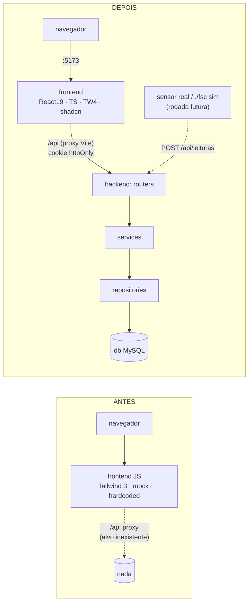
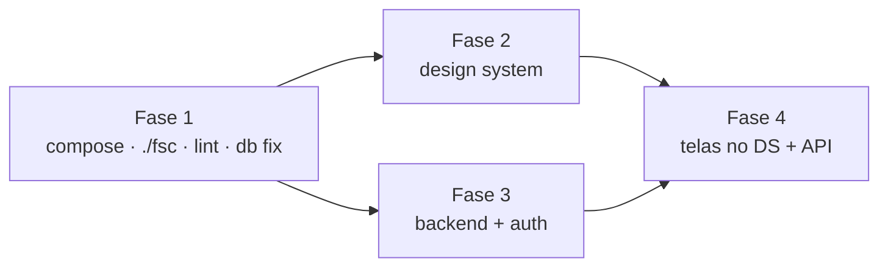
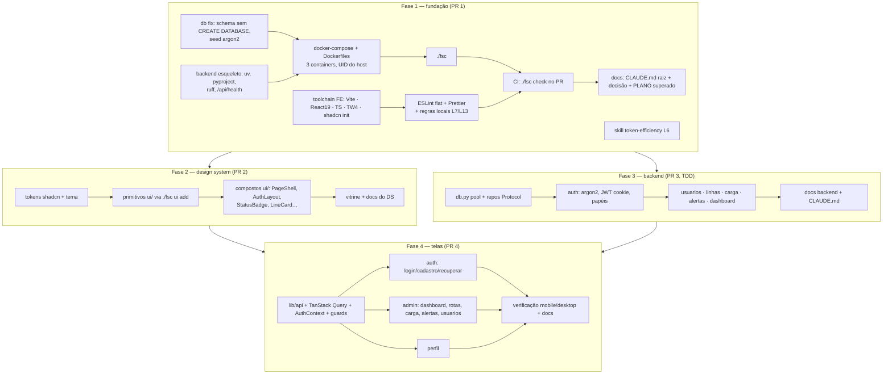

# Fundação + Design System (Living Plan)

> Status: **LOCKED** — plano travado, pronto pra execução.
> Owner: lowh · Created: 2026-09-22 · Locked: 2026-09-22
> Este arquivo é o **plano de registro** e é pra ser iterado. As seções abaixo são o PISO, não o teto.

---

## 1. Goal (one paragraph)

Transformar o repo (hoje só um front JS com dados mockados) num projeto profissional de 3 containers (`frontend`, `backend`, `db`) operado por **um único `./fsc`**. O front é reescrito em **React 19 + TS strict + Tailwind v4 + shadcn/ui**, com todo componente vivendo em `components/ui/` e um lint que **proíbe** comentários, cor crua, controle HTML cru, estilo inline e import fora da fronteira. Assim o design system é imposto pela ferramenta, não pela boa vontade. O backend FastAPI nasce em camadas (`routers → services → repositories`) pra que a fonte de dados, incluindo sensores IoT reais ou simulados, troque sem mexer no core. As 13 telas existentes migram pro DS consumindo a API real com auth por cookie. A qualidade é garantida por CI no PR.

---

## 2. Locked Decisions

| #  | Decision | Detail |
|----|----------|--------|
| L1 | Slug / arquivo | `docs/tasks/lowh-fundacao-design-system-2026-09-22.md` |
| L2 | Estrutura do plano | Uma spec, em fases por dependência: (1) compose + `./fsc` + lint → (2) design system → (3) backend + auth → (4) reescrita das telas sobre DS + API real. Cada fase = um PR. |
| L3 | Linguagem do front | Migrar pra **TypeScript strict** junto com a reescrita. |
| L4 | Branches remotas `feat/ui-modernizar-frontend`, `feat/tema-escuro` | Ignoradas; só referência de ideias (Toast, WagonIcon). Não mergear, não deletar. |
| L5 | Skill `wise-dev` (releezy) | Não trazer. `/systematic-debugging` segue como a skill de debug. |
| L6 | Skill `token-efficiency` (releezy) | Copiar de `../../releezy/.agents/skills/token-efficiency` pra `.claude/skills/`, removendo da tabela *Boundaries* os owners inexistentes aqui (prompt-engineering, semantic-docs, skill-authoring, wise-dev). |
| L7 | Comentários no código | **Proibidos**, enforçado por lint em `.ts/.tsx/.py`. Whitelist só de pragmas de ferramenta: `eslint-disable*`, `@ts-expect-error`, `# noqa`, `# type: ignore`, shebang. Remove a exceção "comentário de porquê" do `.claude/CLAUDE.md`. Mecanismo: regra ESLint local + checagem Python no lint do `./fsc`. |
| L8 | Toolchain | Upgrade total: Vite atual, Tailwind v4 (`@tailwindcss/vite`, config em CSS, sem `tailwind.config.js`), React 19. **Tudo roda só em container** — 3 containers: `frontend`, `backend`, `db`. |
| L9 | DX só-container | `frontend/` em bind mount inteiro, container roda com o UID/GID do host; `npm install` dentro do container escreve `node_modules` no host → editor tem tipos e lint. Nada instalado com node do host. |
| L10 | Tokens | Adotar a **nomenclatura shadcn** (`--background`, `--foreground`, `--card`, `--primary`, `--muted`, `--accent`, `--border`, `--input`, `--ring`, `--radius`, …) com a paleta marrom/bege mapeada nela. Somar tokens de status (`success`, `warning`, `danger`). Morre a regra "canais RGB" do `src/theme/CLAUDE.md` (v4 consome a cor direto). |
| L11 | Camadas da lib | **Só `components/ui/`**: primitivos shadcn e compostos do domínio (StatusBadge, LineCard, PageShell, AuthLayout…) moram juntos ali. |
| L12 | Lint/format do front | ESLint flat config + typescript-eslint strict + react-hooks + jsx-a11y + Prettier (`prettier-plugin-tailwindcss`). Backend: ruff (lint + format). |
| L13 | Regras de lint do DS | Todas: (a) **sem cor crua** — hex/rgb/oklch e classes de paleta Tailwind (`bg-red-500`) proibidas fora do arquivo de tokens; (b) **sem controle cru** — `<button>/<input>/<select>/<textarea>/<dialog>` proibidos fora de `components/ui/`; (c) **fronteiras de import** — páginas não importam `@radix-ui/*` nem outras páginas, `ui/` não importa páginas, só `lib/api` chama `fetch`; (d) **sem `style={{}}` nem valor arbitrário** Tailwind (`rounded-[3rem]`). |
| L14 | Dados e formulários | TanStack Query (cache/loading/erro) + react-hook-form + zod (padrão do `<Form>` shadcn). Wrapper fino de `fetch` em `lib/api` (relativo `/api`, trata 401). |
| L15 | Auth | JWT em **cookie httpOnly + SameSite=Lax** (mesma origem via proxy, sem CORS). Hash argon2 via `pwdlib`. Papel vem de `cargo.nivel_acesso` (`cliente`/`operacional`/`gestao`). |
| L16 | Testes do backend | pytest + `TestClient` com **acesso ao banco mockado** (sem banco de teste). |
| L17 | Telas da fase 4 | Migrar as **13 telas existentes** pro DS + API real, aplicando os renomes já travados (`/admin/linhas → /admin/rotas`, `/admin/funcionarios → /admin/usuarios`). Telas novas (trens, sensores, relatórios, notificações) ficam com os donos (`uniformizacao-telas.md` §3), construídas depois sobre o DS. |
| L18 | Endpoints desta rodada | Só o que as telas existentes consomem: auth (login/logout/me/cadastro), usuários CRUD (gestão), linhas, carga, alertas, métricas do dashboard. Guard por papel **no servidor**. Recuperar senha = stub (sem envio de e-mail). |
| L19 | Comandos do `./fsc` | Stack: `up, down, restart, logs [svc], ps, build, sh <svc>`. Qualidade: `test` (só backend, L27), `lint [fe\|be], fmt, typecheck, check`. Banco: `db`, `db:reset` (com confirmação). Front: `ui add <comp>`, `npm <args>`. |
| L20 | Gate automático | Repo `rafawzc/ferrovia_santa_cruz` é **público** → GitHub Actions grátis. Só CI (sem git hook): workflow roda `./fsc check` em todo PR. Ruleset em `main`: sem push direto, só PR, check obrigatório. **lowh não é admin** (push/triage apenas) → o ruleset precisa ser criado pelo dono (rafawzc); entregamos o passo a passo. |
| L21 | Camadas do backend | `routers/` (só HTTP, Pydantic entra/sai) → `services/` (regra de negócio, Python puro, sem FastAPI nem SQL) → `repositories/` (SQL puro parametrizado atrás de um `Protocol`). Service recebe o repo por injeção (`Depends`) → testes trocam o repo por fake (L16). |
| L22 | Fronteira IoT | **Ingestão HTTP**: `POST /api/leituras` com auth por sensor (API key). Sensor real e simulador usam o **mesmo contrato**. Simulador = script rodado por `./fsc sim` dentro do container `backend` (mantém 3 containers). Trocar mock → real = apontar o device pra URL, zero código no core. |
| L23 | Escopo IoT nesta rodada | **Só arquitetura** (camadas prontas pra receber). Endpoint de ingestão + `./fsc sim` entram na rodada das telas de sensores/monitoramento. |
| L24 | `PLANO_IMPLEMENTACAO.md` | Não reescrever (documento entregue). Marcar como **superado** nas seções de CSS Modules/JS, apontando pra nova entrada em `docs/decisoes/` (Tailwind v4 + shadcn + TS, com o porquê). |
| L25 | Correções do `db/` | Na fase 1: seed com hash argon2 real (senha de dev conhecida e documentada); `schema.sql` sem `CREATE DATABASE`/`USE` (usa `MYSQL_DATABASE` do compose). Aplicar com `./fsc db:reset` (só dado de dev). |
| L26 | Deps Python | `uv` + `pyproject.toml` (lockfile; config de ruff/pytest no mesmo arquivo). |
| L27 | Testes do front | **Nenhum.** Sem Vitest/Testing Library. Gate do front = `typecheck` + `lint` + build. `./fsc test` = só backend. `.claude/CLAUDE.md` atualizado: sai "Vitest + Testing Library", `/tdd` vale só pro backend. Verificação de tela continua manual (mobile + desktop no navegador). |

---

## 3. Open Decisions

- _nenhuma_

---

## 4. Codebase Findings

**Infra**
- Não existe `backend/`, `docker-compose.yml`, Dockerfile, Makefile nem script de projeto. `.claude/CLAUDE.md` descreve uma stack que ainda não existe.
- Esqueleto do compose só no papel: `docs/arquitetura/containers-e-rede.md` (db mysql:8 com healthcheck, backend/db sem `ports:`, frontend :5173, rede `internal`).
- `db/schema.sql`: 9 tabelas (`cargo`, `usuario`, `linha`, `trem`, `sensor`, `leitura_sensor`, `carga`, `alerta`, `relatorio`). `db/seed.sql` 3–10 linhas por tabela.
  - Hash de seed `$2b$12$exemploHash...` não é bcrypt válido → `checkpw` levanta `ValueError` → 500.
  - `schema.sql:14-18` chumba `CREATE DATABASE`/`USE ferrovia_santa_cruz` → conflita com `MYSQL_DATABASE` do compose.
  - `alerta.status` VARCHAR livre vs. `linha.status` ENUM. `relatorio` sem CHECK `periodo_fim >= periodo_inicio`.
- `docs/backend/acesso-a-dados.md` usa `trens`/`estacao_id` — não existem.

**Frontend** (`frontend/`, ~1.250 linhas JSX)
- React 18.3 · Vite 4.5 · Tailwind 3.4 · react-router-dom 7 (modo declarativo) · lucide-react. JS puro.
- ESLint 8 config legado (`.eslintrc.cjs`). Sem Prettier, sem testes (sem Vitest, sem script `test`).
- `vite.config.js`: proxy `/api → http://backend:8000`.
- Tokens: `src/index.css`, canais RGB (`--color-bg: 196 162 125`), `:root` claro / `[data-theme="dark"]`. Nomes: `bg, surface, surface-2, primary, on-primary, text, text-muted, panel, field, border`. Mapeados em `tailwind.config.js` como `rgb(var(--x) / <alpha-value>)`. `error`/`success` hex fixo. Sem tokens de radius/spacing/shadow.
- Tema: `src/theme/ThemeProvider.jsx` (`useTheme` → `{theme, toggleTheme}`), anti-FOUC inline em `index.html`. Regras em `src/theme/CLAUDE.md`.
- `index.css` tem `input:focus { outline: none }` global → quebra a11y.
- 11 componentes caseiros (`Button` com ícone Fingerprint embutido, `Modal` que não é dialog, `Tabs` sem ARIA…). Sem `cn()`.
- 13 rotas, tudo mock hardcoded, zero `fetch`. Sem guards, sem AuthContext; login só faz `navigate('/admin')`.
- Duplicação: layout de auth x3, shell de página x9 (sem layout route), bloco de perfil x3, lista de funcionários mockada x3 (divergentes).
- Design: `docs/design/mobile/` (18 PNG), `docs/design/desktop/` (9 PNG), paleta em `docs/design/guia-de-estilo/paleta-de-cores.png` (Poppins).
- `docs/PLANO_IMPLEMENTACAO.md` planeja CSS Modules + `styles/tokens.css` (conflita com Tailwind), `routes/` com guards, `context/AuthContext`, `services/http.js`, `pages/cliente/`, DataTable/ConfirmModal/Toast.
- `docs/decisoes/uniformizacao-telas.md`: 11 telas obrigatórias, renomes `/admin/linhas → /admin/rotas`, `/admin/funcionarios → /admin/usuarios`.

---

## 5. Structured Analysis

### 5.1 Problem Model

- **Pedido:** front "pro", padronizado por um design system próprio (shadcn como base), lint que imponha o padrão, `./fsc` como porta única de operação, e um backend "de sênior" desacoplado pra IoT.
- **Premissa escondida que caiu:** "revisar o backend" → o backend **não existe**. A rodada inclui criar backend, compose e Dockerfiles.
- **Restrições:** tudo em container (L8), 3 containers, só o `frontend` exposto, SQL parametrizado, sem ORM, sem comentários (L7), sem testes de front (L27), projeto de grupo com telas por dono (L17).
- **O que o lint precisa garantir:** que um colega não consiga fugir do DS. Regra escrita no CLAUDE.md sem enforcement = ignorada.

### 5.2 System Impact

- **Novo:** `docker-compose.yml`, `frontend/Dockerfile`, `backend/` inteiro, `./fsc`, `.github/workflows/ci.yml`, `frontend/eslint.config.js` + regras locais, `.prettierrc`, `backend/pyproject.toml`.
- **Reescrito:** `frontend/src/**` (JSX → TSX), `src/index.css` (tokens shadcn), `ThemeProvider` (mantém mecânica `data-theme` + anti-FOUC do `index.html`, só troca nomes de token).
- **Corrigido:** `db/schema.sql` (sem `CREATE DATABASE`), `db/seed.sql` (hash argon2 real).
- **Removido:** `tailwind.config.js`, `postcss.config.js`, `.eslintrc.cjs`, `App.css`, `assets/react.svg`, `public/vite.svg`, `input:focus { outline: none }`.
- **Reuso:** paleta de `docs/design/guia-de-estilo/`, mapa status→cor de `uniformizacao-telas.md` L6/L7, esqueleto do compose de `docs/arquitetura/containers-e-rede.md`, mecânica de tema de `src/theme/`.
- **Docs/CLAUDE.md:** `.claude/CLAUDE.md` (lint, sem comentários sem exceção, sem teste de front, `./fsc` como porta), `frontend/CLAUDE.md` (novo), `frontend/src/components/ui/CLAUDE.md` (regras do DS), `backend/CLAUDE.md` (camadas), `src/theme/CLAUDE.md` (sem regra RGB), `docs/decisoes/` (nova decisão), `docs/CLAUDE.md` (índice), `docs/backend/acesso-a-dados.md` (tabelas reais).

### 5.3 Strategies

**S1 — Fundação primeiro, fases em cadeia (recomendada).** Infra/lint antes de qualquer tela, porque o lint é o que impede o DS de nascer já furado. Backend e DS são independentes e podem correr em paralelo.

- Prós: cada PR já passa pelo gate; DS e backend em paralelo; telas só uma vez, já no formato final.
- Contras: nada visível na tela até a fase 2.

**S2 — Telas primeiro, lint depois.** Migra telas pro shadcn, liga o lint no fim.
- Contras: o lint ligado no fim acusa centenas de violações; retrabalho. Descartada.

**S3 — Backend primeiro, front depois.** Serializa tudo.
- Contras: perde o paralelismo DS ‖ backend sem ganho nenhum. Descartada.

### 5.4 Risks

- **R1 — Testes de backend com banco mockado (L16):** o SQL cru nunca é executado em teste; erro de coluna/sintaxe só aparece rodando. Mitigação: repositórios finos (só SQL, sem regra) e um smoke manual via `./fsc` contra o banco de dev antes de fechar a fase 3.
- **R2 — Sem teste de front (L27):** regressão de tela só aparece no navegador. Mitigação: TS strict + lint rígido + build no CI; checklist manual mobile/desktop por tela.
- **R3 — Bind mount + UID (L9):** arquivos criados como root se o `user:` do compose falhar. Mitigação: `./fsc` exporta `UID`/`GID` pro compose; checagem no `./fsc up`.
- **R4 — Ruleset depende do dono (L20):** lowh não é admin; sem ruleset, o CI é só informativo. Mitigação: passo a passo pro rafawzc no PR da fase 1.
- **R5 — Colegas com trabalho em andamento:** telas mudam de rota/pasta (L17) e de linguagem (TS). Mitigação: `frontend/CLAUDE.md` + doc do DS com "como criar uma tela"; avisar os donos antes do merge da fase 4.
- **R6 — Regra "sem comentário" x shadcn:** o código gerado pelo CLI shadcn traz comentários. Mitigação: `./fsc ui add` roda o CLI e depois o fix do lint/strip; componente só entra limpo.
- **R7 — `db:reset` apaga dados:** só dev, mas é destrutivo. Mitigação: confirmação explícita no `./fsc` (regra NEVER do CLAUDE.md).

### 5.5 Validation

- **Fase 1:** `./fsc up` sobe os 3 containers healthy; `docker compose ps` mostra portas só no `frontend`; `./fsc check` verde; um arquivo com comentário / `bg-red-500` / `<button>` em página / `style={{}}` faz `./fsc lint` falhar (provar com arquivo temporário); CI verde no PR.
- **Fase 2:** página de vitrine do DS renderiza todo `ui/` nos dois temas, mobile e desktop; `./fsc typecheck` e `lint` verdes.
- **Fase 3:** `./fsc test` verde (pytest, repos fakes); login com usuário do seed via `curl` pelo proxy retorna `Set-Cookie` httpOnly; rota de gestão com cookie de `cliente` → 403; sem cookie → 401; input inválido → 422.
- **Fase 4:** cada tela verificada no navegador em 414px e 1920px, nos dois temas, com dado vindo da API; guard de rota redireciona por papel.

### 5.6 Out of Scope

- Telas novas: trens, sensores, relatórios, notificações (donos em `uniformizacao-telas.md` §3).
- Ingestão IoT (`POST /api/leituras`) e `./fsc sim` (L23).
- Envio real de e-mail em recuperar senha (stub, L18).
- Testes de front (L27).
- Tabela `notificacoes` e demais deltas de banco abertos em `uniformizacao-telas.md` §9.
- Criar o ruleset no GitHub (depende do dono, L20).
- Build de produção / deploy (só ambiente de dev em compose).

### 5.7 Recommended Plan

Paralelismo: dentro da fase 1, `A2`, `A4`, `A6`, `A8` saem juntos. Fases 2 e 3 correm em paralelo (worktrees separadas). Fase 4 só depois das duas.

### 5.8 Next Action

Criar a worktree `feat/fundacao` e disparar em paralelo `A2` (db fix), `A4` (toolchain FE) e `A6` (esqueleto backend).

---

## 6. Implementation Log

### Fase 1 — fundação (branch `feat/fundacao`) — concluída em 2026-09-22

| Item do plano (5.7) | Commit | O que entrou |
|---------------------|--------|--------------|
| Plano | `dfd50e8` | Esta spec. |
| A8 — skill token-efficiency (L6) | `59b0fa7` | `.claude/skills/token-efficiency/`, tabela de owners enxugada. |
| A1 — compose (L8, L9) | `f284867` | 3 serviços, só `frontend` publica porta (5173), redes `internal` + `edge`, `depends_on` em cadeia com `service_healthy`, healthcheck do db por TCP. |
| A3 — `./fsc` (L19) | `d9deec7` | Stack, qualidade, banco (`db:reset` com confirmação), `npm`, `ui add`. |
| A1 — collation | `c9625ff` | `utf8mb4_unicode_ci` fixada no `command:` do db. |
| A2 — db fix (L25) | `53cd37d` | `schema.sql` sem `CREATE DATABASE`/`USE`; seed com argon2 real, senha de dev `ferrovia123`. |
| A4 — toolchain FE (L3, L8) | `6c30da5` | Vite 8, React 19, Tailwind 4 (`@theme` no `index.css`), TS strict. |
| A5 — lint/format FE (L7, L12, L13) | `2916aed`, `266c31b` | ESLint 9 flat + regras locais do DS + Prettier; formatação aplicada. |
| A6 — backend esqueleto (L21, L26) | `b51f8c6` | FastAPI + `/api/health`, uv, ruff, `check_comments.py`, pytest. |
| A7 — CI (L20) | `a123fd9` | `.github/workflows/ci.yml`, job `check` rodando `./fsc check` em PR e push na `main`. |
| A9 — docs | `b12e451`, `204fc92`, `4d0ca26`, `e81e0ee`, `d765c03`, `6511560`, `fda0ce8` | Decisão `decisoes/frontend-e-qualidade.md` + superados no `stack.md`/`PLANO`; `arquitetura/containers-e-rede.md` alinhado ao compose real + `arquitetura/operacao.md` (quickstart, ruleset); `backend/acesso-a-dados.md` com tabelas reais; `frontend/tema.md` no Tailwind v4; notas de superado em `responsividade.md`/`requisitos.md`; README; `.claude/CLAUDE.md` + `.opencode/AGENTS.md`. |

### Desvios do plano

- **Frontend sem Dockerfile.** O plano previa `frontend/Dockerfile`; o serviço usa `node:24-slim` direto, com bind mount e UID do host. Não havia nada pra buildar que a imagem oficial não resolvesse.
- **`shadcn init` foi pra fase 2.** Os nomes de token do shadcn (`--color-primary`, `--color-border`…) colidem com os atuais; o init vai junto com o renome dos tokens (L10).
- **TypeScript pinado em `~6.0.x`.** O `typescript-eslint` só aceita `typescript <6.1.0`; TS 7 quebra o lint type-aware.
- **ESLint 9, não 10.** O `eslint-plugin-jsx-a11y` só aceita até `^9`.
- **`uv` instalado via `pip`** no `backend/Dockerfile`, em vez de `COPY --from=ghcr.io/astral-sh/uv`, pra não depender de lookup de credencial do `ghcr.io`.
- **Collation fixada no compose** (`command:` do db), já que o `CREATE DATABASE` que a definia saiu do `schema.sql`.
- **Telas `.jsx` legadas fora do typecheck e do lint** até a reescrita em TSX (fase 4).

### Fase 3 — backend API (branch `feat/backend-api`) — concluída em 2026-09-22

| Item do plano (5.7) | Commit | O que entrou |
|---------------------|--------|--------------|
| C1 — `db.py` + segurança (L15, L21) | `815a80f` | Pool único preguiçoso + `cursor()` context manager; argon2 (pwdlib) + JWT HS256 (PyJWT, 8h); deps `mysql-connector-python`, `pwdlib[argon2]`, `pyjwt`; `.env.example` com `DB_HOST` e `JWT_SECRET` de 32+ bytes. |
| C2 — auth (L15, L18) | `c0cad8b` | `login` (cookie `sessao` HttpOnly/SameSite=Lax/8h), `logout`, `me`, `cadastro` (cargo = `DEFAULT` do banco), `recuperar-senha` stub 202; `usuario_atual` + `exige_papel`; `IntegrityError` → 409. |
| C3 — usuários | `54be1d1` | CRUD gestão (`DELETE` = desativar) + `GET /api/cargos`. |
| C3 — linhas, carga, alertas | `4de14b0` | `GET /api/linhas`, `GET/POST /api/cargas`, `GET/POST /api/alertas` (operacional + gestão). |
| C3 — dashboard | `fc98ebd` | `GET /api/dashboard`: linhas ativas, em manutenção, sensores, velocidade média. |
| C4 — docs | `301c2a9` | `docs/backend/api.md` (contrato), `backend/CLAUDE.md`, `acesso-a-dados.md` com o `db.py` real, índice. |

Verificação: `./fsc check` verde (53 testes). Smoke R1 real via proxy do Vite (projeto compose isolado `fsc-api-smoke`, porta 5199, banco recém-seedado): todos os endpoints com 200/201/204/202 no caminho feliz e 401/403/404/409/422 nos erros esperados.

#### Desvios da fase 3

- **Sem `app/core/settings.py`.** Só dois lugares leem env (`db.py` e `core/security.py`); um módulo de settings seria wrapper de `os.environ`. Leitura é preguiçosa → importar o app em teste não exige banco.
- **Router → repo direto quando não há regra** (linhas, cargas, alertas, dashboard). `services/` só existe onde há regra (`usuarios.py`: auth, cadastro, hash, desativar). O `Protocol` mora no service.
- **Papel relido do banco a cada request**, não só do JWT: desativar/trocar cargo vale na hora (o `papel` continua no token, como pedido).
- **`DELETE /api/usuarios/{id}` desativa** (soft delete) — `relatorio.usuario_id` é `RESTRICT` e o histórico precisa do autor. `PATCH {"ativo": true}` reativa.
- **`GET /api/cargos`** entrou (não estava no L18): o cadastro de funcionário precisa dos ids.
- **Status cru do banco** em `linha.status` e `alerta.status`; rótulo/cor ficam no front (L7), tabela no `api.md`.
- **Mensagens de 422 em inglês** (padrão Pydantic, com `type`/`loc` estáveis pro front traduzir).
- **Rota de API segue o banco** (`/api/linhas`, `/api/usuarios`), não o vocabulário do Guia (L1 é só de UI).

#### Não coberto pelo schema / fora do escopo

- Manutenções pendentes/finalizadas (sem tabela), ocupação de vagões/poltronas e passageiros (sem colunas), velocidade/sensores por linha (derivável, não pedido).
- `PATCH` do próprio perfil (`/perfil/editar`) — fora do L18; reusa `services.usuarios.atualizar` quando vier.
- `null` no `PATCH` não apaga campo (SQL estático com `COALESCE`).
- Ingestão IoT (L23): só o espaço nas camadas, descrito no `backend/CLAUDE.md`.

### Pendente fora do repo

- Ruleset da `main` (L20, R4): o dono (rafawzc) cria seguindo [`../arquitetura/operacao.md`](../arquitetura/operacao.md).
