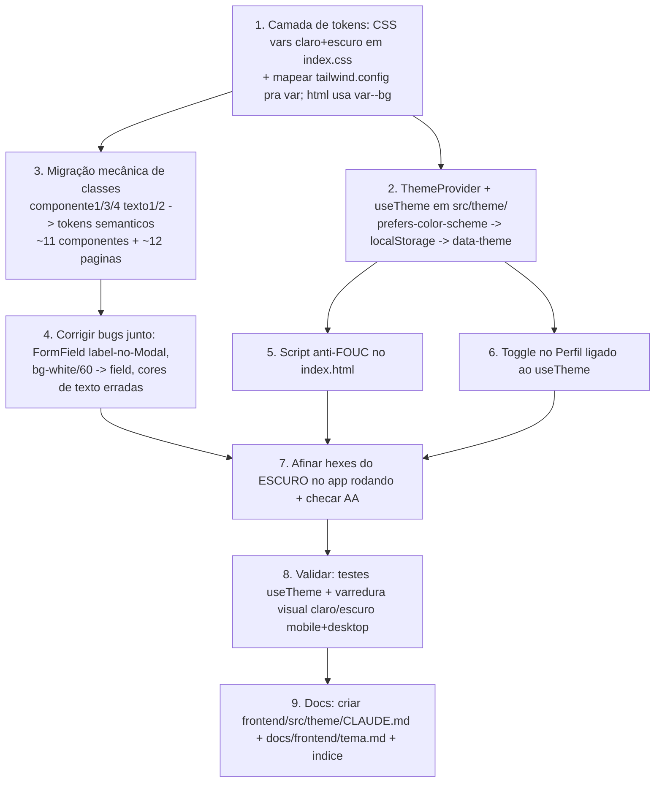

# Sistema de Temas — claro/escuro (Living Plan)

> Status: **LOCKED** — decisões travadas, pronto pra implementação.
> Owner: lowh · Created: 2026-07-06 · Locked: 2026-07-06 · Issue: #14
> Este arquivo é o **plano de registro** e é feito pra ser iterado. As seções abaixo são o PISO, não o teto.

---

## 1. Goal (one paragraph)

Refatorar o frontend pra ter um **sistema de temas claro/escuro** de verdade. Hoje não existe: as cores são hex estático no `tailwind.config.js` e o fundo do `<html>` é chumbado no `index.css`. Esta rodada cria a **infraestrutura de tema** (tokens Tailwind apoiados em CSS variables, `data-theme` no `<html>`, contexto React + toggle + persistência em `localStorage`, respeitando `prefers-color-scheme` na 1ª visita), **deriva uma paleta escura em marrom** (sem preto puro) a partir da paleta base, **corrige o contraste das fontes no claro** e faz o **fundo do `<html>` seguir o token do tema ativo**. Objetivo: as ~20 telas viram theme-aware sem redesenho individual, sem regressão no claro.

---

## 2. Locked Decisions

| #  | Decision | Detail |
|----|----------|--------|
| L1 | Slug/arquivo | `docs/tasks/lowh-sistema-de-temas-2026-07-06.md`. |
| L2 | Tema na 1ª visita | `prefers-color-scheme` decide o default; a escolha manual grava em `localStorage` e passa a mandar em cima do OS. |
| L3 | Onde fica o toggle | Na página **Perfil** (`/perfil`) — é a tela de preferências do usuário; menor mudança visual. |
| L4 | Escopo desta rodada | **Infra + correção da dívida de cor**: tokens→CSS vars semânticos, migração de classes, paleta escura, correção de contraste do claro, fundo do html theme-aware, toggle+persistência. **SEM redesenhar layout de telas** (só troca de token, tema claro pixel-idêntico). Auditoria estética tela-a-tela no escuro fica pra rodada 2. |
| L5 | Arquitetura | **Tokens semânticos por PAPEL** (`--bg`, `--surface`, `--primary`, `--text`, `--on-primary`…) apoiados em CSS variables que trocam por tema. Migra as classes das ~20 telas (mecânico; claro fica pixel-idêntico). Mata papel-duplo e bugs de contraste na raiz; escuro = swap limpo de valores. |
| L6 | Nomes dos tokens | **Puro semântico**, dropar `componente1/3/4`/`texto1/2`/`bg-base`/`bg-card`. Nomes dizem o papel. |
| L7 | Bugs de contraste/hardcode | **Corrigir todos nesta rodada** (Tarefa 2 da issue): label `FormField` dentro de Modal, `bg-white/60`→`--field`, cores de texto erradas. Sem isso o escuro herda os mesmos bugs. |
| L8 | Cores de status | **Deixar como estão** (paleta Tailwind pura — verde/amarelo/vermelho/laranja). São sinais semânticos universais, não cor de marca; leem OK nos dois temas. Ajuste fino no escuro fica pra rodada 2 se precisar. |
| L9 | Paleta escura | Aprovada a **proposta da §5.3 como ponto de partida** (bg `#241a14`, surface `#33241b`, primary caramelo `#a86a3f`, text creme…); hexes finos afinados vendo o **app rodando** no `/tdd`. |
| L10 | Anti-FOUC | **Sim** — script inline (~5 linhas) no `<head>` do `index.html` seta `data-theme` a partir de `localStorage`/`prefers-color-scheme` ANTES do React montar. |
| L11 | Local do contexto | `src/theme/` — `ThemeProvider` + hook `useTheme()` (`{ theme, toggleTheme }`), provider no topo do `App.jsx`. |

---

## 3. Open Decisions

- [x] _Zero. Todas resolvidas (ver Locked Decisions)._ Único detalhe deixado pro `/tdd`: mecanismo do fix de contraste FormField-no-Modal (prop `onDark` vs token contextual `--on-surface`) — implementação, não arquitetura.

---

## 4. Codebase Findings

Fatos puxados do código (confirmados por leitura direta + agente de exploração):

**Não existe sistema de tema algum.** Nenhum `data-theme`, `.dark`, `ThemeContext`, `useTheme`, `localStorage`, `prefers-color-scheme` ou `darkMode` no Tailwind. O componente `Toggle` é um switch de formulário genérico (remember-me / termos), não de tema.

- **`frontend/tailwind.config.js`** — fonte única das cores, como `theme.extend.colors` em **hex estático** (não CSS vars):
  ```js
  texto1: '#44312b', texto2: '#eae6de',
  componente1: '#6d412a', componente3: '#c2b19c', componente4: '#daccbe',
  'bg-base': '#c4a27d', 'bg-card': '#c2b19c',
  error: '#dc2626', success: '#16a34a',
  ```
  Sem `componente2` (a paleta pula 1→3→4; o `#c4a27d` "Componente 2" virou `bg-base`). `darkMode` não setado.
- **`frontend/src/index.css`** — únicos 2 hex crus fora dos assets:
  - `html, body, #root { background-color: #efe8de; }` (fundo global chumbado — **cor diferente** do `bg-base #c4a27d` que as telas pintam por cima)
  - `body { color: #44312b; }` (duplica `texto1` como hex cru)
- **Componentes 100% via token** — `Button, FormField, InfoCard, LineCard, Modal, ScreenHeader, StatusBadge, Tabs, Toggle, UserCard, BottomNav` usam classes tipo `bg-componente1`, `text-texto1`. Nenhum hex inline nas `.jsx`. → retrofit centraliza limpo.
- **`Tabs.jsx`** — ativo: `bg-componente1/text-texto2`; inativo: `bg-componente3/text-texto1`.
- **Sem `CLAUDE.md` em `frontend/`** (nem subpastas). `App.css` vazio.

**Paleta base (fonte da verdade — `docs/design/guia-de-estilo/paleta-de-cores.png`):**
| Nome | Hex | Papel |
|------|-----|-------|
| Texto 1 | `#44312b` | marrom escuro — texto primário |
| Componente 1 | `#6d412a` | marrom — componente ativo/primário |
| Componente 2 | `#c4a27d` | tan — usado como `bg-base` |
| Componente 3 | `#c2b19c` | taupe — componente secundário / `bg-card` |
| Componente 4 | `#daccbe` | taupe claro |
| Texto 2 | `#eae6de` | creme — texto sobre fundo escuro |

**Telas/abas (superfície que não pode regredir):**
Auth: Login, Cadastro, RecuperarSenha. Admin: Dashboard, UsuariosLista, UsuarioDetalhe, UsuarioEditar, CargaLista, CargaCadastro, Linhas, Alertas. Shared: Perfil. BottomNav: Início, Carga, Linhas, Alertas, Funcionários, Perfil.

**Uso real dos tokens (grep em `src/`, ordenado por frequência):**
| Token | Papel dominante | Nº usos notáveis |
|-------|-----------------|------------------|
| `text-texto2` | tinta creme sobre fundos escuros (botões, badges) | 37 |
| `text-texto1` | tinta marrom escura sobre fundos claros | 33 (+ `/60 /50 /40` = texto secundário/muted) |
| `bg-componente1` | fundo primário/ativo (botões, tab ativa) | 18 (+ `/90 /80 /10`) |
| `bg-bg-base` | fundo de página | 18 |
| `bg-componente3` | fundo de card / secundário / tab inativa | 13 (+ `/80 /50`) |
| `bg-bg-card` | fundo de card | 3 |
| `bg-componente4` | superfície mais clara | 2 |
| `text-componente1` | texto/acento marrom sobre claro | 4 |
| `error` / `success` | validação | 1 cada |

**⚠️ Tokens com PAPEL DUPLO (o nó do tema escuro):**
- `texto1` = tinta escura **E** fundo decorativo escuro. `bg-texto1` em: `Login.jsx:109`, `Cadastro.jsx:85`, `RecuperarSenha.jsx:94` (painel lateral desktop) + `Toggle.jsx:15` (`bg-texto1/20`, trilha). No escuro, `text-texto1` precisa virar CLARA, mas esses `bg-texto1` querem ficar escuros → conflito num único token.
- `texto2` = tinta clara **E** fundo decorativo claro. `bg-texto2/80` em `CargaLista.jsx:62,63,103,104` (bolinhas do mapa de poltronas). Menos crítico: creme funciona nos dois temas.

**Hex crus restantes (só 2, ambos em `index.css`):** `#efe8de` (fundo global) e `#44312b` (cor de body, duplica texto1). Nenhum hex inline em `.jsx`.

**Mapa semântico real (o que cada token É na prática, lendo TODOS os componentes):**
| Token atual | Valor | Papel semântico real | Onde |
|-------------|-------|----------------------|------|
| `bg-base` | `#c4a27d` | fundo de página | todas as telas admin |
| `componente3` | `#c2b19c` | superfície taupe: inputs, cards secundários, tab inativa | Dashboard inputs, Tabs, LineCard, UserCard foto |
| `componente4` | `#daccbe` | superfície elevada mais clara: container de KPIs, botão secundário | Dashboard KPI box, Button secondary |
| `componente1` | `#6d412a` | **DUPLO**: ação primária (botão) **E** superfície escura de card | Button primary, Modal, UserCard, BottomNav, InfoCard icon, Tabs ativa |
| `texto1` | `#44312b` | **DUPLO**: tinta escura (sobre claro) **E** fundo decorativo escuro | text-texto1 (33×) + bg-texto1 (painel auth) |
| `texto2` | `#eae6de` | **DUPLO**: tinta creme (sobre escuro) **E** marcador claro | text-texto2 (37×) + bg-texto2 (bolinhas) |

**Sloppiness confirmada (fora do sistema de cores):**
- `FormField.jsx` → input `bg-white/60` (branco cru, sem token).
- `StatusBadge.jsx` → cores de status via paleta Tailwind pura (`text-yellow-400/red-400/green-400/orange-400`), não tokens do projeto.
- `UserCard.jsx` / `LineCard.jsx` → `text-green-300/red-300`, também paleta pura.
- **Bug de contraste (claro):** `Modal` é `bg-componente1` (escuro) mas os labels do `FormField` dentro dele são `text-texto1` (tinta escura) → escuro-sobre-escuro. Mesmo componente funciona no Login (fundo claro). Causa raiz: escolha de tinta na mão, sem regra superfície→tinta.

---

## 5. Structured Analysis

### 5.1 Problem Model

Do ponto de vista do usuário (issue #14): quer poder usar o app no escuro sem quebrar nada e com o claro legível. Do ponto de vista técnico, o pedido "corrigir o tema escuro" é na verdade **construir** o sistema de tema — não existe. A causa raiz da "porcaria": tokens nomeados por VALOR (`componente1`), não por PAPEL, o que faz o mesmo token virar botão E card escuro, e obriga a escolher a cor da tinta na mão (gerando bugs de contraste). Assunção escondida surfaçada: o design base foi feito só pro claro; o escuro precisa ser DERIVADO com julgamento, não invertido mecanicamente.

### 5.2 System Impact

**Camada de tokens semânticos (o coração).** Definidos como CSS variables em `src/index.css`: `:root` (claro) e `[data-theme="dark"]` (escuro). O `tailwind.config.js` mapeia cada cor Tailwind pra `var(--token)`. Valores do CLARO = hex atual, então a migração de classes é pixel-idêntica.

| Token semântico | Classe Tailwind | Valor CLARO | Substitui (classes atuais) |
|-----------------|-----------------|-------------|----------------------------|
| `bg` | `bg-bg` | `#c4a27d` | `bg-base` |
| `surface` | `bg-surface` | `#c2b19c` | `componente3`, `bg-card` (cards taupe, inputs, tab inativa) |
| `surface-2` | `bg-surface-2` | `#daccbe` | `componente4` (KPI box, botão secundário) |
| `primary` | `bg-primary` / `text-primary` / `border-primary` | `#6d412a` | `componente1` (botão, ativo, Modal, nav, UserCard, borders, rings) |
| `on-primary` | `text-on-primary` | `#eae6de` | `texto2` (tinta creme sobre primary/escuro) |
| `text` | `text-text` | `#44312b` | `texto1` (tinta escura) |
| `text-muted` | `text-text-muted` | `#6b5245`* | `texto1/60 /50 /40` (secundário) |
| `panel` | `bg-panel` | `#44312b` | `bg-texto1` (painel decorativo auth desktop) |
| `field` | `bg-field` | `#ffffff` (@ 60% via classe) | `bg-white/60` do FormField |
| `border` | `border-border` | `#6d412a` | rings/borders (= primary no claro) |
| `error` / `success` | idem | `#dc2626` / `#16a34a` | inalterado |

*`text-muted` vira um valor sólido em vez de `texto1/opacity`, pra ter contraste previsível nos dois temas.

**Arquivos tocados:** `tailwind.config.js` (mapear pra vars), `src/index.css` (definir vars claro+escuro, html usa `var(--bg)`, remover 2 hex crus), `index.html` (script anti-FOUC), novo `src/theme/` (`ThemeProvider`, `useTheme`), `App.jsx` (envolver no provider), `Perfil.jsx` (toggle), e **migração mecânica de classe** em ~11 componentes + ~12 páginas. Bugs corrigidos junto: FormField label-no-Modal, `bg-white/60`→`field`.

**Módulo profundo a extrair (interface simples, comportamento rico):** `useTheme()` — expõe `{ theme, toggleTheme }`; esconde leitura de `prefers-color-scheme`, `localStorage` e escrita do `data-theme` no `<html>`.

### 5.3 Strategies

**Paleta ESCURA proposta (marrom, sem preto puro — a derivar/confirmar):**

| Token | CLARO | ESCURO (proposto) | Racional |
|-------|-------|-------------------|----------|
| `bg` | `#c4a27d` | `#241a14` | marrom bem escuro, quente, NÃO preto |
| `surface` | `#c2b19c` | `#33241b` | card acima do bg, ainda marrom escuro |
| `surface-2` | `#daccbe` | `#402f24` | superfície elevada, um degrau mais clara |
| `primary` | `#6d412a` | `#a86a3f` | marrom-caramelo mais claro pra saltar no escuro e segurar contraste com `on-primary` |
| `on-primary` | `#eae6de` | `#f4efe8` | creme (texto sobre botão) — quase igual |
| `text` | `#44312b` | `#efe7dd` | tinta CLARA (inverte) — creme legível sobre escuro |
| `text-muted` | `#6b5245` | `#b7a493` | taupe claro, secundário legível |
| `panel` | `#44312b` | `#3a281d` | painel decorativo — marrom rico, distinto do bg |
| `field` | `#ffffff@60` | `#4a382c` (sólido) | input escuro com `text` claro por cima |
| `border` | `#6d412a` | `#5a4636` | hairline sutil entre superfícies escuras |
| `error`/`success` | iguais | iguais | sinais universais (L8) |

> Valores a validar visualmente num preview antes de travar. AA de contraste como piso.

### 5.3.1 Strategies (descartadas)

- **CSS var atrás dos nomes velhos** (componente1 etc.) — menos churn, mas não resolve papel-duplo nem bugs de contraste. Descartada (L5).
- **`darkMode: 'class'` do Tailwind com variantes `dark:`** — exigiria escrever `dark:bg-...` em cada classe de cada tela (dobra as classes, +churn) e NÃO centraliza. CSS var no token é superior: troca num lugar só, componente não sabe do tema. Descartada.
- **Inverter a paleta mecanicamente** — geraria marrons lavados/sujos. Escuro é DERIVADO com julgamento (L9).

### 5.4 Risks

- **Regressão visual no claro durante a migração de classe** (~23 arquivos). Mitigação: valores claros dos tokens = hex atual → deve ficar pixel-idêntico; verificar tela a tela no app rodando (`/run`/`/verify`) e diff visual. É o maior risco.
- **Contraste insuficiente no escuro** (AA). Mitigação: afinar hexes no app real (L9), piso AA em texto/`on-primary`.
- **Papel-duplo mal separado** — se `panel`/`primary`/`surface` forem confundidos na migração, um card escuro pode virar botão. Mitigação: seguir a tabela §5.2 como fonte da verdade do mapeamento.
- **FOUC / SSR-none** — app é SPA Vite puro, script inline resolve (L10).
- **Container** — build/preview roda via `docker compose` (P0). Não testar no host.

### 5.5 Validation

Comportamento observável, não implementação:
1. **Toggle** no Perfil troca `data-theme` no `<html>` e persiste (recarregar mantém). Teste Vitest do `useTheme` (mock `localStorage`/`matchMedia`).
2. **1ª visita** sem `localStorage` respeita `prefers-color-scheme` (teste com `matchMedia` mockado).
3. **Sem regressão no claro** — cada tela abre idêntica ao atual (verificação visual no app, os dois breakpoints — mobile 390 / desktop 1440, P1).
4. **Fundo do `<html>`** acompanha o tema (sem faixa `#efe8de` órfã).
5. **Contraste no escuro** — texto legível em todas as telas; bug do FormField-no-Modal sumiu nos dois temas.
Espelhar padrão de teste existente em `frontend` (Vitest + Testing Library, rodando no container).

### 5.6 Out of Scope

- **Redesenho estético tela-a-tela no escuro** (rodada 2) — esta rodada garante legível + sem regressão, não "lindo em cada tela".
- **Tokenizar cores de status** (L8) — ficam paleta Tailwind pura.
- **Tema por-usuário no backend** — persistência é só `localStorage`, client-side. Sem coluna no banco.
- **Mais de 2 temas** (ex: alto-contraste) — só claro/escuro.

### 5.7 Recommended Plan



Passos **1 e (2,3)** podem começar juntos após 1 (2 e 3 são paralelos entre si; 3→4 encadeados). 5 e 6 dependem só do provider (2). 7 é a barreira que junta tudo antes de validar.

### 5.8 Next Action

Rodar `/tdd`: escrever o primeiro teste RED do `useTheme` (toggle troca `data-theme` no `<html>` e persiste no `localStorage`), depois GREEN mínimo — isso força nascer a camada `src/theme/` (passo 2) que o resto pendura. A camada de tokens (passo 1) é o par: CSS vars + mapa no Tailwind, verificando que o claro não mexeu.
