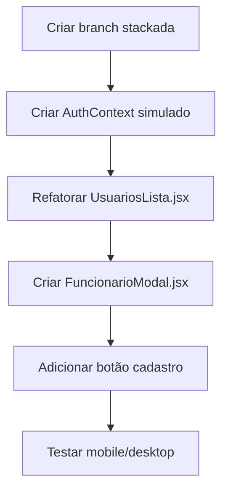

# Refatorar Lista de Funcionários (Living Plan)

> Status: **LOCKED** · Locked: 2026-06-26
> Owner: rafawzc · Created: 2026-06-26
> This file is the **plan of record** and is meant to be iterated on. The sections below are the FLOOR, not the ceiling — add anything the topic demands (UX Spec, Implementation Log, Audit Findings, …).

---

## 1. Goal (one paragraph)

Refatorar a aba de lista de funcionários para seguir o padrão visual do projeto, adicionar botão de cadastro, transformar a edição em popup com background translúcido, e implementar controle de acesso por cargo (apenas cargos específicos verão botão de cadastro e popup de edição).

---

## 2. Locked Decisions

| #  | Decision | Detail |
|----|----------|--------|
| L1 | Cargos com acesso: admin, administracao, rh | Nível de acesso 'gestao' no banco. Cargos operacionais (maquinista, etc) não acessam. |
| L2 | Popup de edição abre ao clicar no card | Para cargos com acesso. Cards de cargos sem acesso mostram apenas detalhes (read-only). |
| L3 | Dados hardcoded, preparado para API futura | Estrutura de dados similar ao schema do banco, facilita substituição por fetch. |
| L4 | AuthContext simples para simular cargo | Cria contexto com usuário simulado (cargo: 'admin'), fácil de substituir por auth real. |

---

## 3. Open Decisions

- [ ] _nenhuma — todas as decisões foram tomadas_

---

## 4. Codebase Findings

- **Branch atual:** `feat/ui-modernizar-frontend`
- **Arquivo principal:** `frontend/src/pages/admin/UsuariosLista.jsx` — lista com dados hardcoded, navega para详情 e edição via rotas separadas
- **Padrão de cores (tailwind.config.js):**
  - `texto1: '#44312b'` (marrom escuro)
  - `texto2: '#eae6de'` (bege claro)
  - `componente1: '#6d412a'` (marrom médio — botões, cards principais)
  - `componente3: '#c2b19c'` (bege médio — fundos secundários)
  - `componente4: '#daccbe'` (bege claro — botões secundários)
  - `bg-base: '#c4a27d'` (fundo base)
  - `bg-page: '#d5c4a8'` (fundo de página)
- **Modal existente:** `CargoModal.jsx` usa `bg-black/50` como overlay translúcido — padrão a seguir
- **Botão:** `Button.jsx` com variantes `primary`, `secondary`, `outline`
- **Componente de card:** `UserCard.jsx` exibe foto, nome, cargo, status
- **Header:** `ScreenHeader.jsx` com botão voltar e título
- **Nenhum sistema de autenticação/roles existe atualmente** — todos os dados são hardcoded

---

## 5. Structured Analysis

### 5.1 Problem Model

A tela atual é estática (dados hardcoded), não possui controle de acesso, e a edição é uma rota separada (/admin/funcionarios/:id/editar). O usuário quer:
1. Padronizar visual com outras telas
2. Adicionar botão de cadastro (visível apenas para cargos específicos)
3. Transformar edição em popup com background translúcido (visível apenas para cargos específicos)
4. Preparar para conexão futura com banco de dados

### 5.2 System Impact

- **Frontend:** Modificar `UsuariosLista.jsx`, criar componente `FuncionarioModal` (edição/cadastro), possível criação de `AuthContext` para simular roles
- **Backend:** Nenhuma mudança necessária agora (dados hardcoded no frontend)
- **Rotas:** Manter rota de detalhe (`/admin/funcionarios/:id`), remover ou manter rota de edição (depende da decisão)

### 5.3 Strategies

**Estratégia 1: AuthContext + Modal component (Recomendada)**
- Criar `AuthContext` com usuário simulado (cargo: 'admin')
- Criar componente `FuncionarioModal` para edição/cadastro
- Reutilizar padrão de `CargoModal` (overlay `bg-black/50`)
- Mais limpo, preparado para futuro backend

**Estratégia 2: Variável de config global**
- Definir cargo em arquivo de config
- Mais simples, mas menos flexível para substituição futura

### 5.4 Risks

- AuthContext simulado pode precisar de refactor quando integrar auth real
- Dados hardcoded podem confundir quando conectar ao backend

### 5.5 Validation

- Testar visualmente em mobile e desktop
- Verificar que botão/popup aparecem apenas para cargos corretos
- Confirmar que o popup de edição funciona com todos os campos

### 5.6 Out of Scope

- Conexão real com backend/auth
- CRUD completo (apenas UI preparada)
- Validação de formulário complexa

### 5.7 Recommended Plan

### 5.8 Next Action

Criar branch stackada `feat/refatorar-lista-funcionarios` a partir de `feat/ui-modernizar-frontend`.
