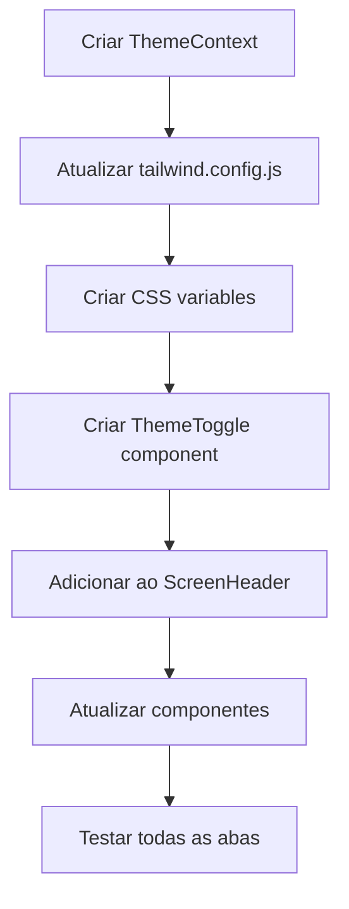

# Tema Escuro (Living Plan)

> Status: **LOCKED** · Locked: 2026-06-26
> Owner: rafawzc · Created: 2026-06-26
> This file is the **plan of record** and is meant to be iterated on. The sections below are the FLOOR, not the ceiling — add anything the topic demands (UX Spec, Implementation Log, Audit Findings, …).

---

## 1. Goal (one paragraph)

Implementar um toggle de tema escuro/claro no sistema Ferrovia Santa Cruz, com persistência da preferência do usuário e aplicação consistente em todas as abas. O botão seguirá o design fornecido pelo usuário, adaptado às cores do sistema.

---

## 2. Locked Decisions

| #  | Decision | Detail |
|----|----------|--------|
| L1 | Escopo | Todas as abas do sistema devem suportar tema escuro |
| L2 | Persistência | Usar `localStorage` para salvar a preferência do usuário |
| L3 | Botão | Adaptar o design fornecido pelo usuário com cores do sistema |
| L4 | Localização | Botão ficará no canto superior direito, fixo em todas as abas |
| L5 | Animação | Transição suave de 300ms entre temas |
| L6 | Cores do Botão | Adaptar cores do sistema (marrom/bege) ao design original |
| L7 | Estratégia | CSS Variables com classe .dark no <html> |
| L8 | Mapeamento de Cores | Inverter texto1/texto2 + escurecer componentes para tema distinto |

---

## 3. Open Decisions

- [ ] _nenhum - todas as decisões foram tomadas_

---

## 4. Codebase Findings

### Cores atuais (tailwind.config.js)
```
texto1: '#44312b' (marrom escuro - texto principal)
texto2: '#eae6de' (bege claro - texto secundário)
componente1: '#6d412a' (marrom - botões, cards)
componente3: '#c2b19c' (bege médio - hover, cards internos)
componente4: '#daccbe' (bege claro - fundo de cards)
bg-base: '#c4a27d' (marrom claro - fundo base)
bg-page: '#d5c4a8' (bege claro - fundo da página)
bg-card: '#c2b19c' (bege - fundo de cards)
error: '#dc2626' (vermelho)
success: '#16a34a' (verde)
```

### Uso das cores nas páginas
- `bg-bg-page`: fundo principal das páginas (Dashboard, Alertas, UsuariosLista, CargaLista, Linhas)
- `bg-componente4`: cards externos (container de status, listas)
- `bg-componente1`: cards internos, botões, itens clicáveis
- `bg-componente3`: hover states, cards internos em Alertas
- `text-texto1`: títulos, labels, textos principais
- `text-texto2`: textos em fundo escuro (componente1)

### Estrutura de componentes
- `BottomNav`: barra de navegação inferior fixa
- `ScreenHeader`: cabeçalho das páginas internas (com botão voltar)
- `FormField`: campos de formulário com labels
- `Button`: botões com variantes primary/secondary/outline

---

## 5. Structured Analysis

### 5.1 Problem Model
O usuário quer um toggle de tema escuro que:
1. Alterne todas as abas para um tema escuro
2. Mantenha as cores do sistema (não mudar drasticamente)
3. Use o design de botão fornecido (toggle com Sol/Lua)
4. Persista a preferência do usuário

### 5.2 System Impact
- **Frontend**: Criar Context de tema, atualizar tailwind.config.js, modificar componentes para usar cores condicionais
- **Componentes afetados**: Todos os componentes que usam cores do sistema
- **Persistência**: localStorage (já disponível no browser)

### 5.3 Strategies

**Estratégia 1: CSS Variables (Recomendada)**
- Criar CSS variables para cada cor
- Alternar entre themes usando classe no `<html>`
- Mais performático, menos re-render

**Estratégia 2: Context + Tailwind Classes**
- Usar React Context para gerenciar estado
- Aplicar classes condicionais em cada componente
- Mais flexível, mas mais verboso

**Recomendação**: Estratégia 1 (CSS Variables) - mais limpo e performático

### 5.4 Risks
- **Flash of unstyled content (FOUC)**: Aplicar tema antes do render inicial
- **Inconsistência**: Alguns componentes podem não seguir o tema
- **Performance**: Muitas re-renderizações se usar Context

### 5.5 Validation
- Testar em todas as abas
- Verificar persistência após refresh
- Testar acessibilidade (contraste)

### 5.6 Out of Scope
- Tema automático baseado no sistema operacional
- Tema por usuário (backend)
- Animações complexas

### 5.7 Recommended Plan



### 5.8 Next Action
Criar o ThemeContext e o componente ThemeToggle adaptado ao design do usuário, posicionado no canto superior direito.

---

## 6. Mapeamento de Cores (Proposta Final)

### Tema Claro (Atual)
| Token | Valor |
|-------|-------|
| texto1 | #44312b |
| texto2 | #eae6de |
| componente1 | #6d412a |
| componente3 | #c2b19c |
| componente4 | #daccbe |
| bg-page | #d5c4a8 |
| bg-base | #c4a27d |

### Tema Escuro (Proposta)
| Token | Valor | Justificativa |
|-------|-------|---------------|
| texto1 | #eae6de | Inverte com texto2 - agora claro em fundo escuro |
| texto2 | #44312b | Inverte com texto1 - agora escuro em fundo claro |
| componente1 | #1a1412 | Marrom muito escuro - cards e botões |
| componente3 | #2d2520 | Marrom escuro - hover states |
| componente4 | #3d3229 | Marrom escuro - fundo de cards |
| bg-page | #0f0c0a | Fundo principal bem escuro |
| bg-base | #1a1412 | Fundo base escuro |

### Cores de Status (mantidas)
| Token | Valor |
|-------|-------|
| error | #dc2626 |
| success | #16a34a |

> Estas cores criam um tema escuro distinto do claro, com boa legibilidade e contraste.

---

## 7. Próximos Passos (após Brainstorming)

1. Criar `frontend/src/contexts/ThemeContext.jsx`
2. Criar `frontend/src/components/ThemeToggle/ThemeToggle.jsx`
3. Atualizar `frontend/tailwind.config.js` com CSS variables
4. Atualizar `frontend/src/index.css` com temas
5. Adicionar ThemeToggle ao ScreenHeader
6. Testar em todas as abas
